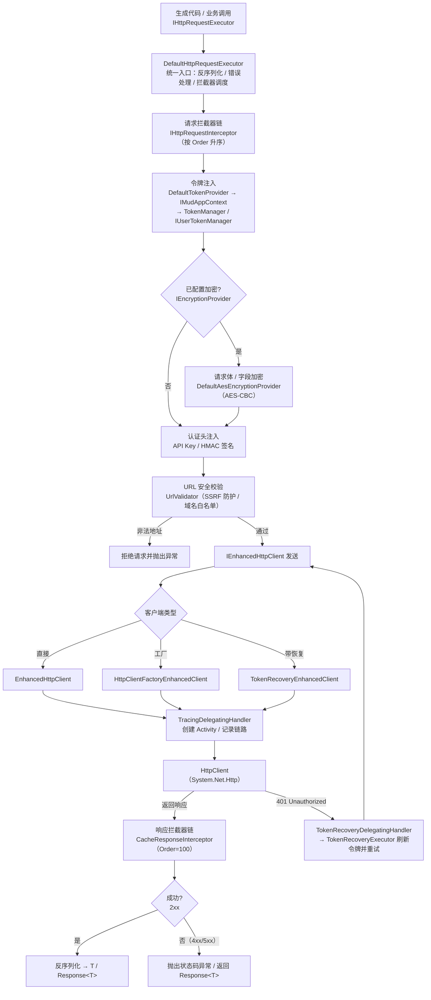
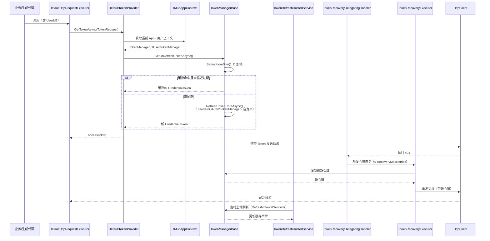

# Mud.HttpUtils.Client

## 概述

Mud.HttpUtils.Client 是 Mud.HttpUtils 的客户端实现层，提供 `IEnhancedHttpClient` 的默认实现、加密提供程序、令牌管理器基类、应用上下文、安全认证、日志脱敏、缓存等核心功能。

## 目标框架

- `netstandard2.0`
- `net6.0`
- `net8.0`
- `net10.0`

## 包含内容

### HTTP 客户端实现

| 类                                | 说明                                                                                                   |
| --------------------------------- | ------------------------------------------------------------------------------------------------------ |
| `EnhancedHttpClient`              | `IEnhancedHttpClient` 默认实现，封装 `System.Net.Http.HttpClient`，支持请求/响应拦截器、基地址动态切换 |
| `DirectEnhancedHttpClient` <sup>internal</sup> | 直接构造的增强客户端，支持加密操作                                |
| `HttpClientFactoryEnhancedClient` | 基于 `IHttpClientFactory` 的增强客户端，支持基地址动态切换                                             |
| `EnhancedHttpClientFactory` <sup>internal</sup> | `IEnhancedHttpClientFactory` 默认实现，按名称创建并缓存客户端实例，.NET 8+ 通过 Keyed Service 解析 |
| `HttpClientResolver`              | `IHttpClientResolver` 默认实现，管理命名客户端注册与解析                                               |

> `DirectEnhancedHttpClient` 与 `EnhancedHttpClientFactory` 为 `internal` 类型，由 `AddMudHttpClient` 内部使用，通常无需在业务代码中直接引用。

### 基地址动态切换

`EnhancedHttpClient` 和 `HttpClientFactoryEnhancedClient` 均实现了 `WithBaseAddress` 方法，支持运行时动态切换基地址：

```csharp
var userClient = httpClient.WithBaseAddress("https://user-api.example.com");
var orderClient = httpClient.WithBaseAddress("https://order-api.example.com");

// 获取当前基地址
var baseAddress = httpClient.BaseAddress;
```

> `WithBaseAddress` 创建新的客户端实例，不影响原客户端。新客户端继承原客户端的超时设置和默认请求头。

### 文件上传进度报告

| 类                          | 说明                                                |
| --------------------------- | --------------------------------------------------- |
| `ProgressableStreamContent` | 支持进度报告的 `HttpContent` 实现，用于文件上传场景 |

```csharp
var content = new ProgressableStreamContent(
    fileContent,
    new Progress<long>(bytesRead => Console.WriteLine($"已上传: {bytesRead} 字节")),
    bufferSize: 8192
);
```

> `ProgressableStreamContent` 在序列化流时通过 `IProgress<long>` 报告已发送字节数，适用于大文件上传进度监控。

### 请求/响应拦截器

| 类                         | 说明           |
| -------------------------- | -------------- |
| `IHttpRequestInterceptor`  | 请求拦截器接口 |
| `IHttpResponseInterceptor` | 响应拦截器接口 |

拦截器按 `Order` 属性排序执行，`Order` 值小的先执行。

### 响应缓存

| 类                         | 说明                                                                        |
| -------------------------- | --------------------------------------------------------------------------- |
| `CacheResponseInterceptor` | 响应缓存拦截器，实现 `ICacheResponseInterceptor`，配合 `CacheAttribute` 使用 |
| `MemoryHttpResponseCache`  | 基于 `IMemoryCache` 的内存响应缓存，实现 `IHttpResponseCache`               |

```csharp
// 注册缓存拦截器
services.AddSingleton<IHttpResponseCache, MemoryHttpResponseCache>();
services.AddSingleton<IHttpResponseInterceptor, CacheResponseInterceptor>();
```

> `CacheResponseInterceptor` 的 `Order` 为 100，确保在其他拦截器之后执行。`MemoryHttpResponseCache` 使用 `IMemoryCache` 作为底层存储，支持绝对过期和滑动过期。

> **注意**：不建议将 `Response<T>` 返回类型与 `[Cache]` 特性组合使用。缓存会存储整个 `Response<T>` 对象（包括 StatusCode 和 ResponseHeaders），可能导致后续请求返回过期的状态码和响应头。源代码生成器会对此组合发出 HTTPCLIENT011 编译警告。

### 加密提供程序

| 类                             | 说明                                                  |
| ------------------------------ | ----------------------------------------------------- |
| `DefaultAesEncryptionProvider` | `IEncryptionProvider` 默认实现，使用 AES-CBC 模式加密 |

```csharp
services.AddMudHttpClient("myApi", encryption =>
{
    encryption.Key = Convert.FromBase64String("your-base64-key");
    // 注意：从 v1.8.0 起 IV 自动随机生成，无需手动设置
}, client =>
{
    client.BaseAddress = new Uri("https://api.example.com");
});
```

> 密钥长度支持 AES-128（16 字节）、AES-192（24 字节）、AES-256（32 字节）。`AesEncryptionOptions.Validate()` 方法在启动时验证密钥的有效性。从 v1.8.0 起，IV 在每次加密时自动随机生成，无需手动设置。

### 安全认证提供程序

| 类                             | 说明                                                         |
| ------------------------------ | ------------------------------------------------------------ |
| `DefaultApiKeyProvider`        | `IApiKeyProvider` 默认实现，从 `IConfiguration` 读取 API Key |
| `DefaultHmacSignatureProvider` | `IHmacSignatureProvider` 默认实现，使用 HMAC-SHA256 算法     |

```csharp
// API Key 认证
services.AddSingleton<IApiKeyProvider, DefaultApiKeyProvider>();

// HMAC 签名认证
services.AddSingleton<IHmacSignatureProvider, DefaultHmacSignatureProvider>();
```

> `DefaultApiKeyProvider` 从 `IConfiguration` 的 `ApiKey` 或 `ApiKeys:Default` 键读取密钥。`DefaultHmacSignatureProvider` 使用 HMAC-SHA256 算法对请求内容计算签名，签名结果以 Base64 编码。

### 日志脱敏

| 类                           | 说明                                                                          |
| ---------------------------- | ----------------------------------------------------------------------------- |
| `DefaultSensitiveDataMasker` | `ISensitiveDataMasker` 默认实现，支持 `Hide`、`Mask`、`TypeOnly` 三种脱敏模式 |

```csharp
services.AddSingleton<ISensitiveDataMasker, DefaultSensitiveDataMasker>();

// 使用
var masker = serviceProvider.GetRequiredService<ISensitiveDataMasker>();
var masked = masker.Mask("13800138000", SensitiveDataMaskMode.Mask, 3, 4);
// 结果: "138****8000"

var maskedObj = masker.MaskObject(userRequest);
// 自动识别 [SensitiveData] 标记的属性并脱敏
```

### 令牌管理

| 类                                | 说明                                                                         |
| --------------------------------- | ---------------------------------------------------------------------------- |
| `TokenManagerBase` <sup>abstract</sup> | 令牌管理器抽象基类（定义于 Abstractions），提供并发安全的令牌刷新，支持绝对过期保护 |
| `UserTokenManagerBase` <sup>abstract</sup> | 用户令牌管理器抽象基类（定义于 Abstractions），提供用户级并发安全刷新和缓存容量控制 |
| `StandardOAuth2TokenManager`      | OAuth2 标准令牌管理器，内置 Authorization Code / Client Credentials / ROPC / Refresh Token 流程 |
| `TokenRefreshHostedService`       | `.NET 6+` 下的令牌后台刷新服务，实现 `IHostedService` 和 `ITokenRefreshBackgroundService`（`netstandard2.0` 下为 `TokenRefreshBackgroundService`，基于 Timer） |
| `TokenRefreshBackgroundService`   | `netstandard2.0` 下的令牌后台刷新服务，基于 Timer 定时刷新                   |
| `TokenRecoveryExecutor`           | 401 令牌刷新重试执行器，被 `TokenRecoveryDelegatingHandler` 与恢复客户端共享  |
| `TokenRecoveryDelegatingHandler`  | 令牌恢复委托处理器，401 响应时自动刷新令牌并重试，支持多种注入模式           |
| `TokenRecoveryEnhancedClient`     | 带令牌恢复的增强客户端，继承 `HttpClientFactoryEnhancedClient`               |
| `DefaultTokenProvider` <sup>internal</sup> | `ITokenProvider` 默认实现（internal），通过 `IMudAppContext` 获取令牌管理器并获取令牌 |
| `DefaultCurrentUserContext<TUser>` | `ICurrentUserContext` 默认实现（泛型，`TUser : CurrentUserInfo, new()`），使用 `AsyncLocal` 实现线程安全的用户 ID 传播 |
| `MemoryTokenStore`                | `ITokenStore` 内存默认实现，支持 `GetTokenTypesAsync`、`ClearAsync` 批量操作 |
| `MemoryUserTokenStore`            | `IUserTokenStore` 内存默认实现，按用户 ID 隔离，支持 `ClearUserAsync` 等     |
| `MemoryEncryptedTokenStore`       | `IEncryptedTokenStore` 内存默认实现，自动加密/解密令牌数据                   |
| `MemoryCacheTokenCache<T>`        | `ITokenCache<T>` 内存缓存实现（基于 `IMemoryCache`），供 `TokenManagerBase` 使用 |
| `DefaultFormContent`              | `IFormContent` 默认实现，基于 `Dictionary<string, string>`                   |

> `TokenManagerBase` 与 `UserTokenManagerBase` 的抽象基类定义位于 `Mud.HttpUtils.Abstractions` 包；`OAuth2TokenManagerBase`（OAuth2 抽象基类）亦定义于 Abstractions。`DefaultTokenProvider` 为 `internal` 类型，由框架在内部使用。`DefaultCurrentUserContext<TUser>` 为泛型实现，使用时需指定用户类型（如 `DefaultCurrentUserContext<MyUser>`，`MyUser` 继承 `CurrentUserInfo`）。

```csharp
// 自定义令牌管理器
public class MyTokenManager : TokenManagerBase
{
    protected override async Task<CredentialToken> RefreshTokenCoreAsync(CancellationToken ct)
    {
        var response = await FetchTokenAsync(ct);
        return new CredentialToken
        {
            AccessToken = response.AccessToken,
            Expire = response.ExpireTime
        };
    }

    public override Task<string> GetTokenAsync(CancellationToken ct = default)
        => GetOrRefreshTokenAsync(ct);
}

// 注册后台刷新服务（推荐方式）
// AddTokenRefreshBackgroundService 内部自动注册为 IHostedService 和 ITokenRefreshBackgroundService，
// 确保两者解析到同一单例实例，消费方可直接注入 ITokenRefreshBackgroundService。
services.AddTokenRefreshBackgroundService(options =>
{
    options.Enabled = true;
    options.RefreshIntervalSeconds = 3500;
    options.RetryDelaySeconds = 60;
    options.StopOnError = false;
});
```

> `TokenManagerBase` 使用 `SemaphoreSlim(1, 1)` 确保同一时刻只有一个线程执行令牌刷新。`UserTokenManagerBase` 使用 `IMemoryCache` 管理用户令牌缓存，支持 `SizeLimit` 限制和自动过期清理。`TokenRefreshHostedService` 支持配置 `RefreshIntervalSeconds`（刷新间隔）、`RetryDelaySeconds`（重试延迟）和 `StopOnError`（出错时是否停止）。非用户令牌的过期提前量由 `TokenManagerBase.ExpireThresholdSeconds` 控制（默认 300 秒，引用 `TokenManagerBase.DefaultExpireThresholdSeconds` 常量）；用户令牌的过期提前量由 `UserTokenCacheOptions.ExpireThresholdSeconds` 控制（默认同样为 300 秒，引用同一常量），可通过 `AddMudHttpUserTokenCacheFromConfiguration` 绑定。

> `DefaultTokenProvider` 是 `ITokenProvider` 的默认实现，通过 `IMudAppContext` 获取令牌管理器并获取令牌。它不持有 `IMudAppContext` 引用，而是通过方法参数逐调用接收，以确保生成代码中 `UseApp()`/`UseDefaultApp()` 上下文切换的正确性。当 `TokenRequest.UserId` 非空时，自动使用 `IUserTokenManager` 获取用户级令牌。

> `DefaultCurrentUserContext` 使用 `AsyncLocal` 确保用户 ID 在异步上下文中正确传播。适用于非 Web 场景或需要手动设置用户 ID 的场景。在 ASP.NET Core 应用中，建议替换为基于 `HttpContext` 的实现。每个实例拥有独立的 `AsyncLocal` 存储，支持多实例并行使用。通过 `SetUser(TUser? user)` 实例方法设置当前用户对象（`TUser` 须继承 `CurrentUserInfo` 且具有无参构造函数），也可通过 `SetUserId(string? userId)` 方法直接设置用户 ID，`UserId` 属性从用户对象中自动提取。

#### 内存令牌存储

```csharp
// 基础内存存储
services.AddSingleton<ITokenStore, MemoryTokenStore>();

// 用户级内存存储
services.AddSingleton<IUserTokenStore, MemoryUserTokenStore>();

// 加密内存存储（需先注册 IEncryptionProvider）
services.AddSingleton<IEncryptionProvider, DefaultAesEncryptionProvider>(/* 配置密钥 */);
services.AddSingleton<IEncryptedTokenStore, MemoryEncryptedTokenStore>();
```

> `MemoryTokenStore` 基于 `ConcurrentDictionary` 实现线程安全的令牌管理，支持过期自动清理。`MemoryUserTokenStore` 为每个用户维护独立的存储空间。`MemoryEncryptedTokenStore` 在存储前自动加密令牌数据，读取时自动解密，适用于对安全性要求较高的场景。

#### 默认表单内容

```csharp
var formData = new Dictionary<string, string>
{
    ["username"] = "admin",
    ["password"] = "secret"
};
var formContent = new DefaultFormContent(formData);
var httpContent = formContent.ToHttpContent(); // FormUrlEncodedContent
```

> `DefaultFormContent` 是 `IFormContent` 的默认实现，将字典数据转换为 `FormUrlEncodedContent`。适用于简单的表单提交场景。

### OAuth2 配置

`OAuth2Options` 用于配置 OAuth2 客户端凭证流程的参数，配置节名称为 `MudHttpOAuth2`。

| 属性 | 类型 | 默认值 | 说明 |
| --- | --- | --- | --- |
| `ClientId` | `string` | `""` | 客户端 ID |
| `ClientSecret` | `string` | `""` | 客户端密钥（明文，建议优先使用 `ClientSecretProviderName`） |
| `ClientSecretProviderName` | `string?` | `null` | 密钥安全提供程序名称，设置后从 `ISecretProvider` 获取密钥 |
| `TokenEndpoint` | `string` | `""` | 令牌端点 URL |
| `RevocationEndpoint` | `string` | `""` | 令牌撤销端点 URL |
| `IntrospectionEndpoint` | `string` | `""` | 令牌内省端点 URL |
| `RequireHttps` | `bool` | `true` | 是否强制 HTTPS 端点 |
| `ExpirySafetyMarginSeconds` | `int` | `60` | 令牌过期安全边际（秒），提前刷新以避免使用过期令牌 |

> **安全提示**：当同时设置 `ClientSecret` 和 `ClientSecretProviderName` 时，`ClientSecretProviderName` 优先生效。建议仅设置其中之一以避免混淆。`AddMudHttpOAuth2FromConfiguration` 会在启动时自动检测此冲突并记录警告日志。

```csharp
// 通过代码配置
services.Configure<OAuth2Options>(options =>
{
    options.ClientId = "my-client";
    options.ClientSecretProviderName = "vault-provider";
    options.TokenEndpoint = "https://auth.example.com/token";
    options.ExpirySafetyMarginSeconds = 90;
});

// 或通过 IConfiguration 绑定
services.AddMudHttpOAuth2FromConfiguration(configuration);
```

对应 `appsettings.json`：

```json
{
  "MudHttpOAuth2": {
    "ClientId": "my-client",
    "ClientSecretProviderName": "vault-provider",
    "TokenEndpoint": "https://auth.example.com/token",
    "RevocationEndpoint": "https://auth.example.com/revoke",
    "IntrospectionEndpoint": "https://auth.example.com/introspect",
    "RequireHttps": true,
    "ExpirySafetyMarginSeconds": 90
  }
}
```

### 用户令牌缓存配置

`UserTokenCacheOptions` 用于配置用户令牌缓存的容量、过期和清理策略，配置节名称为 `MudHttpUserTokenCache`。

| 属性 | 类型 | 默认值 | 说明 |
| --- | --- | --- | --- |
| `SizeLimit` | `int` | `10000` | 缓存容量限制（用户数量） |
| `ExpireThresholdSeconds` | `int` | `300` | 令牌过期提前量（秒），即将过期时触发刷新 |
| `CleanupIntervalSeconds` | `int` | `300` | 缓存清理间隔（秒） |
| `SlidingExpirationSeconds` | `int` | `3600` | 滑动过期时间（秒），未访问则自动移除 |
| `CompactionPercentage` | `double` | `0.2` | 缓存压缩百分比（达容量限制时按此比例淘汰） |

```csharp
// 通过 IConfiguration 绑定
services.AddMudHttpUserTokenCacheFromConfiguration(configuration);
```

> `UserTokenManagerBase` 支持通过 `IOptions<UserTokenCacheOptions>` 从 DI 注入缓存配置。子类构造函数可接收 `IOptions<UserTokenCacheOptions>` 参数，确保通过 `AddMudHttpUserTokenCacheFromConfiguration` 绑定的配置生效。

### 响应缓存配置

`ResponseCacheOptions` 用于控制内存响应缓存的容量与清理策略。该选项作为 `MudHttpClientApplicationOptions.ResponseCache` 子节绑定，也可通过 `AddHttpResponseCache` 扩展方法的参数进行设置。

| 属性 | 类型 | 默认值 | 说明 |
| --- | --- | --- | --- |
| `MaxCacheSize` | `int` | `1000` | 最大缓存条目数，超出后采用 LRU 淘汰 |
| `CleanupIntervalSeconds` | `int` | `60` | 过期缓存清理间隔（秒） |

```csharp
// 通过 AddHttpResponseCache 扩展方法指定参数
services.AddHttpResponseCache(maxCacheSize: 2000, cleanupIntervalSeconds: 120);

// 或从 MudHttpClientApplicationOptions 配置节绑定
// appsettings.json:
// "MudHttpClients": {
//   "ResponseCache": {
//     "MaxCacheSize": 2000,
//     "CleanupIntervalSeconds": 120
//   }
// }
services.AddMudHttpClientsFromConfiguration(configuration);
```

> 当同时调用 `AddHttpResponseCache` 并在 `MudHttpClients:ResponseCache` 配置节中设置值时，两者均使用 `TryAddSingleton` 语义注册——**先注册者生效**。通常建议二选一：
> - 如需从配置文件控制缓存参数，使用 `AddMudHttpClientsFromConfiguration`（内部自动读取 `ResponseCache` 子节）。
> - 如需代码硬编码缓存参数，使用 `AddHttpResponseCache(maxCacheSize, cleanupIntervalSeconds)`。
> - 如需完全自定义缓存实现，直接注册 `IHttpResponseCache`。

### 令牌恢复配置

`TokenRecoveryOptions` 用于控制 401 响应时的自动令牌刷新与重试行为，配置节名称为 `MudHttpTokenRecovery`。

| 属性 | 类型 | 默认值 | 说明 |
| --- | --- | --- | --- |
| `Enabled` | `bool` | `true` | 是否启用令牌恢复机制 |
| `RecoveryMaxRetries` | `int` | `1` | 令牌恢复的最大重试次数（必须 >= 0，启动时由 `TokenRecoveryOptionsValidator` 校验） |
| `TokenScheme` | `string` | `"Bearer"` | 令牌的认证方案（不能为空，启动时校验） |

```csharp
// 通过代码配置
services.Configure<TokenRecoveryOptions>(options =>
{
    options.Enabled = true;
    options.RecoveryMaxRetries = 2;
    options.TokenScheme = "Bearer";
});

// 或通过 IConfiguration 绑定
services.AddMudHttpTokenRecoveryFromConfiguration(configuration);
```

```json
{
  "MudHttpTokenRecovery": {
    "Enabled": true,
    "RecoveryMaxRetries": 2,
    "TokenScheme": "Bearer"
  }
}
```

### 令牌后台刷新配置

`TokenRefreshBackgroundOptions` 用于配置令牌主动刷新后台服务，配置节名称为 `TokenRefreshBackground`。

> **命名差异**：此配置节名称为 `TokenRefreshBackground`，未遵循其他配置节的 `MudHttp` 前缀命名约定，为向后兼容历史版本而保留。下个大版本将统一为 `MudHttpTokenRefreshBackground`。

| 属性 | 类型 | 默认值 | 说明 |
| --- | --- | --- | --- |
| `Enabled` | `bool` | `false` | 是否启用后台刷新，需显式设置为 `true` |
| `RefreshIntervalSeconds` | `int` | `300` | 刷新间隔（秒），必须大于 0 |
| `RetryDelaySeconds` | `int` | `60` | 刷新失败后重试延迟（秒），必须大于 0 |
| `StopOnError` | `bool` | `false` | 刷新失败时是否停止服务 |

```csharp
// 通过代码配置
services.AddTokenRefreshBackgroundService(options =>
{
    options.Enabled = true;
    options.RefreshIntervalSeconds = 3500;
    options.RetryDelaySeconds = 60;
    options.StopOnError = false;
});
```

> `RecoveryMaxRetries` 设置为负数时将抛出 `ArgumentOutOfRangeException`。`TokenScheme` 设置为 null 或空字符串时将抛出 `ArgumentException`。此外，`AddMudHttpTokenRecoveryFromConfiguration` 会注册 `TokenRecoveryOptionsValidator`，在启动时自动校验上述约束。
>
> `RefreshIntervalSeconds` 和 `RetryDelaySeconds` 设置为 0 或负数时将抛出 `ArgumentOutOfRangeException`。此外，`AddTokenRefreshBackgroundService` 和 `AddTokenRefreshBackgroundServiceFromConfiguration` 会注册 `TokenRefreshBackgroundOptionsValidator`，当 `RetryDelaySeconds` 大于等于 `RefreshIntervalSeconds` 时返回校验失败（重试延迟跨越下一个刷新周期可能导致刷新逻辑混乱）。

### 应用上下文

> 应用上下文的接口（`IMudAppContext`、`IAppManager<T>`、`IAppContextSwitcher`）与默认管理器实现（`DefaultAppManager<T>`）定义于 `Mud.HttpUtils.Abstractions` 包。本包提供基于 `AsyncLocal` 的上下文持有器实现。

| 类                          | 说明                                                                       |
| --------------------------- | -------------------------------------------------------------------------- |
| `AsyncLocalAppContextSwitcher` | `IAppContextHolder` 默认实现，基于 `AsyncLocal` 维护当前应用上下文（`Current` / `BeginScope`） |

```csharp
// 多应用管理（IAppManager<T> 默认实现位于 Mud.HttpUtils.Abstractions）
services.AddSingleton<IAppManager<FeishuContext>, DefaultAppManager<FeishuContext>>();

// 监听配置变更
var appManager = serviceProvider.GetRequiredService<IAppManager<FeishuContext>>();
appManager.ConfigurationChanged += (sender, args) =>
{
    Console.WriteLine($"应用 {args.AppId} 配置已变更");
};
```

> `DefaultAppManager<T>` 新增 `ConfigurationChanged` 事件，支持应用配置热更新通知。`IMudAppContext` 新增 `GetService<T>()` 方法，支持从应用上下文中解析 DI 服务。`AsyncLocalAppContextSwitcher` 实现 `IAppContextHolder`，用于在当前异步上下文中切换/持有时应用上下文。

### 工具类

| 类型               | 说明                                       |
| ------------------ | ------------------------------------------ |
| `XmlSerialize`     | XML 序列化/反序列化工具                    |
| `HttpClientUtils`  | HTTP 客户端扩展方法                        |
| `UrlValidator`     | URL 安全验证工具（可配置域名白名单，支持 SSRF 防护） |
| `MessageSanitizer` | 敏感信息脱敏工具（优化字段检测，减少误判） |

### HTTP 请求执行器

| 类                        | 说明                                                                                     |
| ------------------------- | ---------------------------------------------------------------------------------------- |
| `DefaultHttpRequestExecutor` | `IHttpRequestExecutor` 默认实现，统一处理响应反序列化、错误处理和拦截器调用           |

> `DefaultHttpRequestExecutor` 是生成的 API 实现类与运行时之间的桥梁，负责发送 HTTP 请求、处理响应反序列化、错误状态码异常抛出、拦截器调用等逻辑。

### 健康检查

| 类                          | 说明                                                                                     |
| --------------------------- | ---------------------------------------------------------------------------------------- |
| `MudCircuitBreakerHealthCheck` | 熔断器健康检查，报告熔断器当前状态                                                     |
| `TokenRefreshHealthCheck`    | 令牌刷新健康检查，报告令牌刷新服务状态和最近刷新结果                                   |
| `TokenRefreshHealthCheckOptions` | 令牌刷新健康检查配置选项                                                             |

```csharp
// 注册健康检查
services.AddMudHttpHealthChecks();

// 或从 IConfiguration 绑定
services.AddMudHttpHealthChecks(Configuration);
```

> `AddMudHttpHealthChecks()` 扩展方法注册熔断器和令牌刷新健康检查，可配合 ASP.NET Core Health Checks 中间件使用。

#### 令牌刷新健康检查选项

`TokenRefreshHealthCheckSettings`（继承自 `TokenRefreshHealthCheckOptions`，额外增加 `FailureStatus` 属性）用于配置令牌刷新健康检查的窗口期和阈值，在 `appsettings.json` 中位于 `MudHttpHealthChecks:TokenRefresh` 下。

| 属性 | 类型 | 默认值 | 说明 |
| --- | --- | --- | --- |
| `WindowSeconds` | `int` | `300` | 统计窗口期（秒） |
| `DegradedThreshold` | `double` | `0.2` | 告警阈值（失败率 0~1），达到则返回 Degraded |
| `CriticalThreshold` | `double` | `0.5` | 临界阈值（失败率 0~1），达到则返回 Unhealthy |
| `MinSampleSize` | `int` | `5` | 最小样本数，窗口期内总刷新次数低于此值时返回 Healthy |
| `FailureStatus` | `HealthStatus?` | `null` | 失败时返回的健康状态（null 表示由健康检查内部判定） |

#### 熔断器健康检查选项

`CircuitBreakerHealthCheckSettings` 用于配置熔断器健康检查，在 `appsettings.json` 中位于 `MudHttpHealthChecks:CircuitBreakerHealthCheck` 下。

| 属性 | 类型 | 默认值 | 说明 |
| --- | --- | --- | --- |
| `MaxOpenCount` | `int` | `0` | 允许的 Open 状态最大数量 |
| `MaxHalfOpenCount` | `int` | `0` | 允许的 HalfOpen 状态最大数量 |
| `FailureStatus` | `HealthStatus?` | `Unhealthy` | 失败时返回的健康状态 |

对应 `appsettings.json`：

```json
{
  "MudHttpHealthChecks": {
    "TokenRefresh": {
      "WindowSeconds": 300,
      "DegradedThreshold": 0.2,
      "CriticalThreshold": 0.5,
      "MinSampleSize": 5,
      "FailureStatus": "Degraded"
    },
    "CircuitBreakerHealthCheck": {
      "MaxOpenCount": 0,
      "MaxHalfOpenCount": 0,
      "FailureStatus": "Unhealthy"
    }
  }
}
```

> `MudHttpHealthChecks` 下的 `TokenRefresh` 子节会被 `AddMudHttpHealthChecks(IConfiguration)` 自动绑定；`CircuitBreakerHealthCheck` 子节对应 `MudCircuitBreakerHealthCheck.SectionName`（默认 `"CircuitBreakerHealthCheck"`）。

### 可观测性

| 类                      | 说明                                                                   |
| ----------------------- | ---------------------------------------------------------------------- |
| `TracingDelegatingHandler` | 追踪委托处理器，自动创建 Activity 并记录 HTTP 请求链路信息          |
| `MudHttpObservability` <sup>internal</sup> | 可观测性辅助工具（internal），提供指标记录和追踪标签管理            |

> `TracingDelegatingHandler` 作为 `DelegatingHandler` 注入到 HttpClient 管道中，自动创建分布式追踪 Activity 并记录请求方法、URL、状态码、耗时等信息。配合 `Mud.HttpUtils.OpenTelemetry` 包可一键导出到 OTLP 收集器。

#### URL 安全验证

`UrlValidator` 提供 SSRF（服务端请求伪造）防护，支持以下安全策略：

- **域名白名单**：仅允许访问白名单内的域名（含子域名匹配）
- **HTTPS 强制**：仅允许 HTTPS 协议和标准端口（443）
- **私有 IP 检测**：阻止访问 10.x、172.16.x、192.168.x、127.x 等私有地址
- **内网域名检测**：阻止访问 .local、.internal、.lan 等内网域名

**配置方式一：通过配置文件（推荐）**

```json
{
  "MudHttpClients": {
    "AllowedDomains": [ "api.example.com", "cdn.example.com" ],
    "Clients": {
      "Default": {
        "BaseAddress": "https://api.example.com",
        "AllowCustomBaseUrls": false
      },
      "ExternalApi": {
        "BaseAddress": "https://external.api.com",
        "AllowCustomBaseUrls": true
      }
    }
  }
}
```

> `AllowCustomBaseUrls` 默认为 `false`，仅允许访问白名单域名。设为 `true` 时放宽域名限制但仍阻止私有 IP 和内网域名。

**配置方式二：通过代码**

```csharp
// 配置白名单
UrlValidator.ConfigureAllowedDomains(["api.example.com", "cdn.example.com"]);

// 运行时增删域名
UrlValidator.AddAllowedDomain("new-api.example.com");
UrlValidator.RemoveAllowedDomain("old-api.example.com");
```

## 客户端执行逻辑

`Mud.HttpUtils.Client` 在运行时承担「请求组装 → 安全处理 → 发送 → 响应处理」的完整链路。下图展示一次 HTTP 请求在客户端层各组件间的流转：



### 令牌获取与 401 恢复流程

令牌的并发安全获取与「401 自动恢复」由客户端层内部协作完成，独立于业务接口，无需在生成代码中显式处理：



> **要点**：
> - **令牌获取零反射、零上下文持有**：`DefaultTokenProvider` 不持有 `IMudAppContext`，而是通过每次调用的 `TokenRequest`（含 `UserId`）接收上下文，确保 `UseApp()`/`UseDefaultApp()` 切换正确传播。
> - **并发安全刷新**：`TokenManagerBase` 使用 `SemaphoreSlim(1,1)` 保证同一时刻仅一个线程刷新；`UserTokenManagerBase` 通过 `IMemoryCache` 按用户隔离并控制容量（`SizeLimit`）。
> - **401 自愈**：`TokenRecoveryDelegatingHandler` 与 `TokenRecoveryEnhancedClient` 共享 `TokenRecoveryExecutor`，在 `RecoveryMaxRetries` 次数内自动刷新并重试，与弹性装饰器的重试互不干扰。
> - **后台刷新**：`TokenRefreshHostedService`（.NET 6+）/ `TokenRefreshBackgroundService`（netstandard2.0）按 `RefreshIntervalSeconds` 主动刷新，避免临界过期。

## 安装

```xml
<PackageReference Include="Mud.HttpUtils.Client" Version="x.x.x" />
```

## DI 服务注册

### AddMudHttpClient — 注册客户端

| 重载                                                                     | 说明                                             |
| ------------------------------------------------------------------------ | ------------------------------------------------ |
| `AddMudHttpClient(clientName, configureHttpClient)`                      | 注册 Named HttpClient 和 `IEnhancedHttpClient`   |
| `AddMudHttpClient(clientName, baseAddress)`                              | 带基础地址的便捷重载                             |
| `AddMudHttpClient(clientName, configureEncryption, configureHttpClient)` | 带加密配置的重载，同时注册 `IEncryptionProvider` |

> `AddMudHttpClient` 同时注册 `IHttpClientResolver` 为单例服务，支持多命名客户端场景。

### AddMudHttpClientsFromConfiguration — 从配置文件注册

从 `IConfiguration` 自动绑定多个 HTTP 客户端配置，支持全局域名白名单和自定义 URL 策略：

```json
{
  "MudHttpClients": {
    "AllowedDomains": [ "api.example.com", "cdn.example.com" ],
    "DefaultClientName": "Default",
    "ResponseCache": {
      "MaxCacheSize": 2000,
      "CleanupIntervalSeconds": 120
    },
    "Clients": {
      "Default": {
        "BaseAddress": "https://api.example.com",
        "TimeoutSeconds": 30
      },
      "ExternalApi": {
        "BaseAddress": "https://external.api.com",
        "AllowCustomBaseUrls": true
      }
    }
  }
}
```

```csharp
services.AddMudHttpClientsFromConfiguration(Configuration);
```

> **TimeoutSeconds 说明**：`MudHttpClientOptions.TimeoutSeconds` 控制 HttpClient 全局超时（包含所有重试的总时间），与 `TimeoutOptions.TimeoutSeconds`（Polly 单次请求超时）不同。两者可同时配置，详见 [Resilience 文档 - 超时配置](../Mud.HttpUtils.Resilience/README.md#timeoutoptions)。

### 注册安全认证服务

```csharp
// API Key 认证
services.AddSingleton<IApiKeyProvider, DefaultApiKeyProvider>();

// HMAC 签名认证
services.AddSingleton<IHmacSignatureProvider, DefaultHmacSignatureProvider>();
```

### 注册缓存服务

```csharp
services.AddMemoryCache();
services.AddSingleton<IHttpResponseCache, MemoryHttpResponseCache>();
services.AddSingleton<IHttpResponseInterceptor, CacheResponseInterceptor>();
```

### 注册日志脱敏服务

```csharp
services.AddSingleton<ISensitiveDataMasker, DefaultSensitiveDataMasker>();
// 或使用便捷扩展方法
services.AddSensitiveDataMasker();                 // 注册 DefaultSensitiveDataMasker
services.AddSensitiveDataMasker<MyMasker>();        // 注册自定义实现
```

### 便捷注册扩展方法

除手动 `AddSingleton<TInterface, TImpl>()` 外，本包还提供一组语义化扩展方法，自动注册对应的默认实现（含可传入自定义实现的泛型重载）：

| 扩展方法 | 说明 |
| -------- | ---- |
| `AddHttpResponseCache(int maxCacheSize = ResponseCacheOptions.DefaultMaxCacheSize, int cleanupIntervalSeconds = ResponseCacheOptions.DefaultCleanupIntervalSeconds)` | 注册内存响应缓存（等价于 `IHttpResponseCache` + `IHttpResponseInterceptor`） |
| `AddSensitiveDataMasker()` / `AddSensitiveDataMasker<TMasker>()` | 注册敏感数据脱敏器 |
| `AddApiKeyProvider()` / `AddApiKeyProvider<TProvider>()` | 注册 API Key 提供器 |
| `AddHmacSignatureProvider()` / `AddHmacSignatureProvider<TProvider>()` | 注册 HMAC 签名提供器 |
| `AddTokenProvider()` / `AddTokenProvider<TProvider>()` | 注册 Token 提供器（`ITokenProvider`） |
| `AddCurrentUserContext()` / `AddCurrentUserContext<TContext>()` | 注册当前用户上下文（`ICurrentUserContext`） |
| `AddMudHttpOAuth2FromConfiguration(IConfiguration, ...)` | 从 `MudHttpOAuth2` 配置节绑定 OAuth2 选项 |
| `AddMudHttpTokenRecoveryFromConfiguration(IConfiguration, ...)` | 从 `MudHttpTokenRecovery` 配置节绑定令牌恢复选项 |
| `AddMudHttpUserTokenCacheFromConfiguration(IConfiguration, ...)` | 从 `MudHttpUserTokenCache` 配置节绑定用户令牌缓存选项 |
| `AddMudHttpClientsFromConfiguration(IConfiguration, ...)` | 从 `MudHttpClients` 配置节批量注册命名客户端与域名白名单 |

## 依赖项

| 包                                          | 说明                                                          |
| ------------------------------------------- | ------------------------------------------------------------- |
| `Mud.HttpUtils.Abstractions`                | 接口定义                                                      |
| `Microsoft.Extensions.Http`                 | `IHttpClientFactory` 支持                                     |
| `Microsoft.Extensions.Logging.Abstractions` | 日志抽象                                                      |
| `Microsoft.Extensions.Options`              | 选项模式                                                      |
| `Microsoft.Extensions.Caching.Memory`       | 内存缓存（`UserTokenManagerBase`、`MemoryHttpResponseCache`） |

## 设计原则

- **默认实现可替换**：所有核心接口均提供默认实现，但可通过 DI 替换为自定义实现
- **线程安全**：`TokenManagerBase`、`UserTokenManagerBase`、`HttpClientResolver` 均实现并发安全
- **资源管理**：`EnhancedHttpClient` 内部正确管理 `HttpClient` 资源（注：本类未实现 `IDisposable`，由 `IHttpClientFactory` 或 `AddMudHttpClient` 负责生命周期管理）
- **可观测性**：所有关键操作均通过 `ILogger` 记录日志，支持结构化日志
- **性能优先**：使用 `SemaphoreSlim` 替代 `lock`、使用 `IMemoryCache` 替代 `ConcurrentDictionary`、支持大文件上传进度报告
