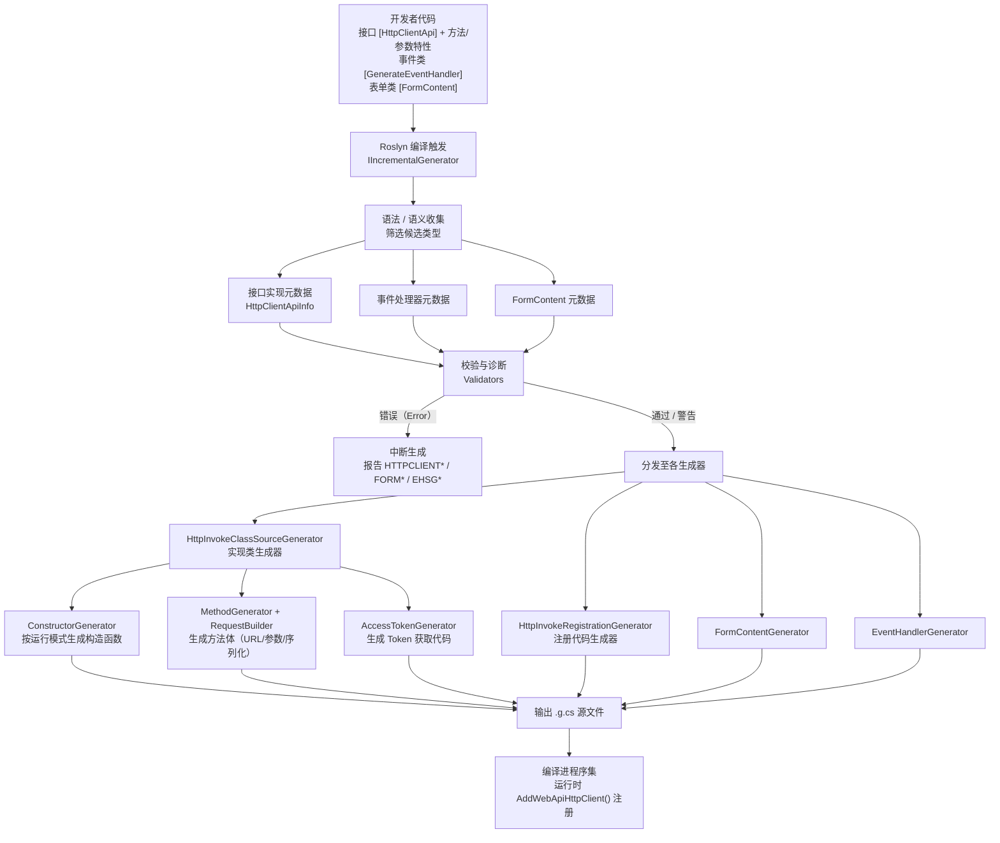
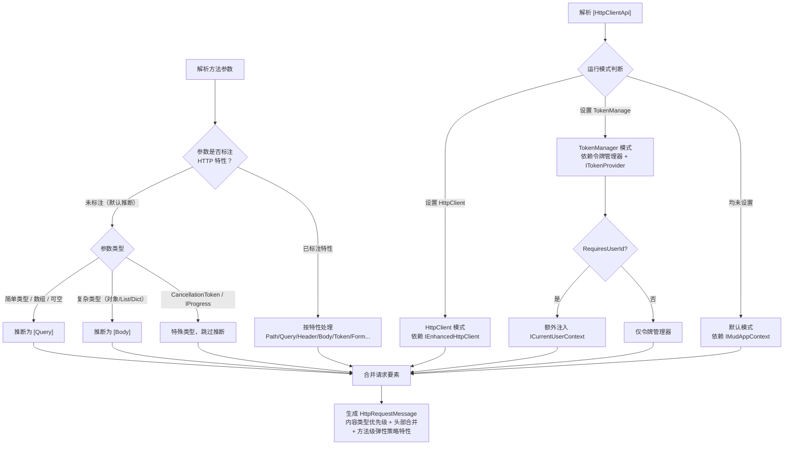

# Mud.HttpUtils.Generator

## 概述

Mud.HttpUtils.Generator 是一个基于 Roslyn 的源代码生成器，自动为标记了 `[HttpClientApi]` 特性的接口生成 HttpClient 实现类和服务注册代码。支持多种 HTTP 方法、灵活的参数处理、内容类型管理、Token 认证（含 API Key / HMAC 签名模式）、请求体加密、流式响应、缓存、日志脱敏等功能。

## 功能特性

### 核心功能

- **自动代码生成**：根据接口定义自动生成 HttpClient 实现
- **HTTP 方法支持**：支持 GET、POST、PUT、DELETE（含请求体）、PATCH、HEAD、OPTIONS 等 HTTP 方法
- **参数处理**：自动处理 Path、Query、Header、Body、FormContent、Form、MultipartForm、Upload 等参数类型
- **Token 管理**：支持多种 Token 类型，TokenType 使用字符串类型，解耦强绑定
- **HttpClient 模式**：支持通过 `HttpClient` 属性直接注入 HttpClient 接口，与 `TokenManage` 互斥
- **依赖注入**：自动生成服务注册扩展方法 `AddWebApiHttpClient()`
- **智能注释**：根据运行模式自动生成 DI 依赖提示注释
- **Timeout 生效**：`[HttpClientApi(Timeout = N)]` 中的 `Timeout` 属性大于 0 时，生成器会在注册代码中生成 `client.Timeout` 设置

### 高级功能

- **内容类型管理**：支持接口级、方法级、参数级的内容类型配置
- **请求/响应类型分离**：支持请求和响应使用不同的内容类型
- **请求体加密**：支持请求体数据加密传输
- **响应解密**：支持响应数据自动解密
- **文件下载**：支持大文件下载和二进制数据下载
- **文件上传进度**：支持通过 `IFormContent` 的 `ToHttpContentAsync(IProgress<long>)` 报告上传进度
- **表单数据**：支持 multipart/form-data 格式，支持 `[JsonPropertyName]` 属性名映射
- **数组查询参数**：支持数组类型的查询参数
- **原始字符串请求体**：支持 `[Body(RawString = true)]` 直接发送原始字符串，支持 `[Body(UseStringContent = true)]` 发送字符串内容
- **继承支持**：支持生成抽象类、类继承、接口继承
- **事件处理器生成**：通过 `[GenerateEventHandler]` 特性自动生成事件处理器代码
- **忽略生成**：支持通过 `[IgnoreGenerator]` 特性忽略特定代码生成（可标注接口、方法、属性、字段）
- **缓存支持**：识别 `[Cache]` 特性，配合 `CacheResponseInterceptor` 实现响应缓存
- **安全认证**：识别 `TokenInjectionMode.ApiKey` 和 `TokenInjectionMode.HmacSignature` 模式
- **日志脱敏**：识别 `[SensitiveData]` 特性，配合 `ISensitiveDataMasker` 实现日志脱敏
- **Token Scopes**：识别 `[Token(Scopes = "...")]` 特性，支持 OAuth2 令牌作用域
- **Base Path 支持**：识别 `[BasePath]` 特性，支持接口级统一路径前缀，支持占位符
- **接口级动态属性**：识别接口上标记 `[Query]`/`[Path]`/`[Header]` 的属性，生成实现类属性并应用于所有方法
- **QueryMap 参数映射**：识别 `[QueryMap]` 特性，将对象/字典展开为查询参数，支持序列化控制和属性分隔符
- **RawQueryString**：识别 `[RawQueryString]` 特性，直接传递原始查询字符串
- **Response\<T\> 包装类型**：支持返回 `Response<T>` 类型，同时提供响应内容和元数据
- **默认参数推断**：未标注任何 HTTP 参数特性的参数，根据类型自动推断为 `[Query]`（简单类型）或 `[Body]`（复杂类型）
- **弹性策略特性**：识别 `[Retry]`、`[Timeout]`、`[CircuitBreaker]` 方法级特性
- **头部合并控制**：识别 `[HeaderMerge]` 特性，控制接口级与方法级同名头部的合并策略
- **序列化方法控制**：识别 `[SerializationMethod]` 特性，指定接口或方法级别的请求体序列化方式
- **接口级固定参数**：识别 `[InterfacePath]` 和 `[InterfaceQuery]` 特性，为接口所有方法自动添加固定路径/查询参数
- **允许任意状态码**：识别 `[AllowAnyStatusCode]` 特性，错误状态码不抛异常
- **编译诊断**：提供 `HTTPCLIENT*` / `HTTPCLIENTREG*` / `EHSG*` / `FORM*` / `AOT*` 等多组编译期诊断（错误与警告），其中部分支持通过 IDE 代码修复器（CodeFix）一键修复，详见「编译诊断」章节

## 安装

```bash
dotnet add package Mud.HttpUtils.Generator
```

> 源代码生成器需配合运行时库 `Mud.HttpUtils` 一起使用。

> **v2.1+ 合并包**：本包已包含接口规范 / DI 生命周期分析器（`MUD001`/`MUD002`/`MUD004`，已并入生成器程序集）和代码修复器（`HTTPCLIENT005`/`007`、`AOT004`/`005`/`006`/`007` 一键修复，独立程序集）。`Mud.HttpUtils.Analyzers` 与 `Mud.HttpUtils.CodeFixes` 均已不再作为独立包存在，无需单独安装。

## 快速开始

### 1. 定义 API 接口

```csharp
using Mud.HttpUtils.Attributes;

[HttpClientApi(HttpClient = "IEnhancedHttpClient")]
public interface IUserApi
{
    [Get("/users/{id}")]
    Task<UserInfo> GetUserAsync([Path] int id);

    [Post("/users")]
    Task<UserInfo> CreateUserAsync([Body] CreateUserRequest request);

    [Get("/users")]
    Task<List<UserInfo>> GetUsersAsync([Query] string? name = null, [Query] int page = 1);
}
```

### 2. 注册服务

```csharp
// 注册 HttpClient + 弹性策略（需 using Mud.HttpUtils.Resilience;）
services.AddMudHttpUtils("userApi", "https://api.example.com");

// 注册生成器生成的 API 接口实现
services.AddWebApiHttpClient();
```

### 3. 使用 API

```csharp
public class UserService
{
    private readonly IUserApi _api;

    public UserService(IUserApi api)
    {
        _api = api;
    }

    public async Task<UserInfo> GetUserAsync(int id)
    {
        return await _api.GetUserAsync(id);
    }
}
```

## 代码生成逻辑

源代码生成器在编译期将「声明式接口」转换为「强类型实现类 + DI 注册代码」。整体流程可分为**输入收集 → 校验诊断 → 分发生成 → 编译输出**四个阶段：



### 运行模式与参数推断

单个接口/方法的生成逻辑包含两类关键决策：**运行模式选择**（决定构造函数依赖）与**参数推断**（决定每个参数如何映射到 HTTP 请求）：



> **要点**：
> - `HttpClient` 与 `TokenManage` 互斥，同时设置时 `HttpClient` 优先（对应诊断 `HTTPCLIENT007`）。
> - 方法参数优先级高于接口级动态属性（`[Query]`/`[Path]` 接口属性）；同名时方法参数覆盖接口属性，接口属性为 `null` 时跳过。
> - 内容类型优先级：`Body 参数级 > 方法级 > 接口级 > 默认 (application/json)`。

## 三种运行模式

生成器根据 `[HttpClientApi]` 特性配置生成不同的实现代码：

### 模式一：默认模式（IMudAppContext）

不设置 `TokenManage` 和 `HttpClient` 时，构造函数依赖 `IHttpContentSerializer`（可选）和 `IMudAppContext`。

```csharp
[HttpClientApi]
public interface IMyApi { }

// 生成的构造函数：
// public MyApi(IMudAppContext appContext, IAppContextHolder appContextHolder, IHttpRequestExecutor executor, IHttpContentSerializer? contentSerializer = null, ILogger? logger = null)
```

### 模式二：TokenManager 模式

设置 `TokenManage` 时，构造函数依赖指定的 Token 管理器类型、`ITokenProvider`（可选）、`ICurrentUserContext`（当 `RequiresUserId = true` 时）和 `IHttpContentSerializer`（可选）。

```csharp
[HttpClientApi(TokenManage = "IFeishuAppManager")]
public interface IMyApi { }

// 生成的构造函数：
// public MyApi(IFeishuAppManager appManager, IAppContextHolder appContextHolder, ITokenProvider tokenProvider, IHttpRequestExecutor executor, IHttpContentSerializer? contentSerializer = null, ILogger? logger = null)
// 当 RequiresUserId = true 时：
// public MyApi(IFeishuAppManager appManager, IAppContextHolder appContextHolder, ITokenProvider tokenProvider, ICurrentUserContext currentUserContext, IHttpRequestExecutor executor, IHttpContentSerializer? contentSerializer = null, ILogger? logger = null)
```

### 模式三：HttpClient 模式（推荐）

设置 `HttpClient` 时，构造函数依赖指定的 HttpClient 接口类型和 `IHttpContentSerializer`（可选）。不生成 Token 相关代码。

```csharp
[HttpClientApi(HttpClient = "IEnhancedHttpClient")]
public interface IMyApi { }

// 生成的构造函数：
// public MyApi(IEnhancedHttpClient httpClient, IHttpRequestExecutor executor, IHttpContentSerializer? contentSerializer = null, ILogger? logger = null)
```

> **注意**：`HttpClient` 与 `TokenManage` 互斥，同时定义时 `HttpClient` 优先。

## 生成的代码

### 实现类

对于接口 `IUserApi`，生成器会生成 `UserApi` 实现类，位于原始接口命名空间的 `.Internal` 子命名空间下：

```csharp
namespace MyApp.Internal
{
    internal partial class UserApi : IUserApi
    {
        // 构造函数和字段（根据运行模式不同而不同）
        // 所有接口方法的实现
    }
}
```

### 服务注册扩展方法

生成器会生成 `HttpClientApiExtensions` 类，包含 `AddWebApiHttpClient()` 扩展方法：

```csharp
public static partial class HttpClientApiExtensions
{
    public static IServiceCollection AddWebApiHttpClient(this IServiceCollection services)
    {
        // 注册 IUserApi 的 HttpClient 包装实现类（瞬时服务）
        // 注意：实现类构造函数依赖 IEnhancedHttpClient，请确保已通过 AddMudHttpClient 等方法注册此服务
        services.AddTransient<global::MyApp.IUserApi, global::MyApp.Internal.UserApi>();
        return services;
    }
}
```

#### Timeout 配置生成

当 `[HttpClientApi(Timeout = N)]` 中 `Timeout > 0` 时，生成器会在注册方法中添加 `client.Timeout` 设置：

```csharp
[HttpClientApi(HttpClient = "IEnhancedHttpClient", Timeout = 50)]
public interface IMyApi { }

// 生成的注册代码：
services.AddTransient<global::MyApp.IMyApi>(sp =>
{
    var httpClient = sp.GetRequiredService<global::Mud.HttpUtils.IEnhancedHttpClient>();
    var client = httpClient as global::Mud.HttpUtils.HttpClientFactoryEnhancedClient;
    if (client != null)
    {
        var innerClient = client.Client;
        innerClient.Timeout = TimeSpan.FromMilliseconds(50000);
    }
    return new global::MyApp.Internal.MyApi(option, httpClient);
});
```

#### 智能注释提示

生成器会根据运行模式自动生成 DI 依赖提示：

| 模式         | 生成的注释                                                                                        |
| ------------ | ------------------------------------------------------------------------------------------------- |
| HttpClient   | `// 注意：实现类构造函数依赖 IEnhancedHttpClient，请确保已通过 AddMudHttpClient 等方法注册此服务` |
| TokenManager | `// 注意：实现类构造函数依赖 IFeishuAppManager，请确保已注册此令牌管理器服务`                     |
| 默认         | `// 注册 XX 的 HttpClient 包装实现类（瞬时服务）`                                                 |

### 注册组

通过 `RegistryGroupName` 可以将多个接口的注册方法分组：

```csharp
[HttpClientApi(RegistryGroupName = "External")]
public interface IExternalApi { }

[HttpClientApi(RegistryGroupName = "External")]
public interface IAnotherExternalApi { }

// 生成 AddExternalWebApiHttpClient() 方法
services.AddExternalWebApiHttpClient();
```

## 特性详解

### HttpClientApi 特性

```csharp
[HttpClientApi(
    ContentType = "application/json",        // 默认请求内容类型
    Timeout = 50,                            // 超时时间（秒），默认 50
    TokenManage = "ITokenManager",           // Token 管理器接口（与 HttpClient 互斥）
    HttpClient = "IMyHttpClient",            // HttpClient 接口（与 TokenManage 互斥，优先）
    RegistryGroupName = "Example",           // 注册组名称
    IsAbstract = false,                      // 是否生成抽象类
    InheritedFrom = "BaseClass"              // 继承的基类
)]
public interface IExampleApi { }
```

> **CFG-27**：`BaseAddress` 构造函数与属性**已移除**（使用将产生编译错误 `CS0117`）；
> 请通过 `AddMudHttpClient(clientName, baseAddress)` 或 `AddMudHttpGeneratedClient<T>(clientName)` 配置基地址。

> TokenManager 模式下，生成器会自动注入 `ITokenProvider` 用于统一 Token 获取。当 `[Token(RequiresUserId = true)]` 时，还会自动注入 `ICurrentUserContext` 并生成只读属性 `CurrentUserId => _currentUserContext.UserId`。

### HTTP 方法特性

```csharp
[Post(
    "/api/users",                           // 请求路径
    ContentType = "application/json",       // 请求内容类型
    ResponseContentType = "application/xml",// 响应内容类型
    ResponseEnableDecrypt = false           // 响应是否启用解密
)]
Task<UserInfo> CreateUserAsync([Body] UserRequest request);
```

### 内容类型优先级

```
Body 参数级 > 方法级 > 接口级 > 默认值 (application/json)
```

### 参数特性

#### Path 参数

`[Path]` 也可以使用别名 `[Route]`（两者等价）：

```csharp
[Get("/users/{id}/posts/{postId}")]
Task<Post> GetPostAsync([Path] int id, [Route] int postId);
```

#### Query 参数

`[Query]` 除支持数组分隔符（`[Query(Separator = ",")]`，同 `[ArrayQuery]`）外，还支持方法级、接口级固定查询参数（见「接口级固定参数」章节）。

```csharp
[Get("/users")]
Task<List<User>> GetUsersAsync(
    [Query] string? name = null,
    [Query] int page = 1,
    [Query] int pageSize = 20,
    [Query(Separator = ",")] int[] ids   // 普通 [Query] 也支持 Separator 将数组序列化为单个参数
);
```

#### 数组 Query 参数

```csharp
[Get("/users")]
Task<List<User>> GetUsersAsync(
    [ArrayQuery] int[] ids,              // 默认分号分隔
    [ArrayQuery(Separator = ",")] string[] tags  // 逗号分隔
);
```

#### Header 参数

```csharp
[Get("/users")]
Task<User> GetUserAsync([Header("X-Custom-Header")] string customValue);
```

#### Body 参数

```csharp
// 基本 Body 参数
[Post("/users")]
Task<User> CreateUserAsync([Body] UserRequest request);

// 指定内容类型
[Post("/users")]
Task<User> CreateUserAsync([Body("application/xml")] UserRequest request);

// 启用加密
[Post("/users")]
Task<User> CreateUserAsync(
    [Body(
        EnableEncrypt = true,
        EncryptSerializeType = SerializeType.Json,
        EncryptPropertyName = "data"
    )] UserRequest request
);

// 原始字符串内容
[Post("/content")]
Task PostContentAsync([Body(RawString = true)] string content);

// 字符串内容（调用 ToString()）
[Post("/text")]
Task SendTextAsync([Body(UseStringContent = true)] object message);
```

#### Form 参数（URL 编码表单字段）

```csharp
[Post("/api/login")]
Task<LoginResult> LoginAsync(
    [Form("username")] string user,
    [Form("password")] string pass);
```

#### MultipartForm 参数（多部分表单字段）

```csharp
[Post("/api/upload")]
Task<UploadResult> UploadFileAsync(
    [MultipartForm] IFormFile file,
    [MultipartForm] string description);
```

#### Upload 参数（文件上传）

```csharp
// 基本文件上传
[Post("/api/upload")]
Task<UploadResult> UploadAsync([Upload] IFormFile file);

// 自定义字段名和文件名
[Post("/api/upload")]
Task<UploadResult> UploadDocumentAsync(
    [Upload(FieldName = "document", FileName = "report.pdf")] IFormFile file);

// 指定内容类型
[Post("/api/upload")]
Task<UploadResult> UploadImageAsync(
    [Upload(ContentType = "image/png")] IFormFile image);
```

#### FilePath 参数（文件下载）

```csharp
[Get("/files/{fileId}")]
Task DownloadFileAsync([Path] string fileId, [FilePath(BufferSize = 81920)] string savePath);
```

#### FormContent 参数（表单数据）

```csharp
[Post("/upload")]
Task UploadAsync([FormContent] IFormContent formData);

// 带上传进度
[Post("/upload")]
Task UploadAsync([FormContent] IFormContent formData, IProgress<long>? progress = null);
```

> `FormContentGenerator` 支持 `[JsonPropertyName]` 特性，当属性标记了 `[JsonPropertyName("custom_name")]` 时，生成的表单字段名使用 `custom_name` 而非 C# 属性名。`IFormContent.ToHttpContentAsync(IProgress<long>?)` 支持上传进度报告。

### Token 认证

```csharp
// 接口级设置 Token 类型
[Token("TenantAccessToken")]
public interface IMyApi { }

// 方法级设置 Token 类型
[Get("/api/user/profile")]
[Token("UserAccessToken", Scopes = "user:read")]
Task<Profile> GetProfileAsync();

// 参数级设置 Token 类型
[Get("/users/{id}")]
Task<User> GetUserAsync([Path] int id, [Token("UserAccessToken")] string? token = null);

// Token 注入模式
[Token("AppAccessToken", InjectionMode = TokenInjectionMode.Header, Name = "Authorization")]

// Token 作用域
[Token("UserAccessToken", Scopes = "user:read,user:write")]

// 使用 TokenManagerKey 解耦业务概念和技术查找键
[Token(TokenType = "UserAccessToken", TokenManagerKey = "FeishuUser")]
public interface IFeishuUserApi { }

// 使用 RequiresUserId 指定需要用户 ID
[Token(TokenType = "UserAccessToken", RequiresUserId = true)]
public interface IUserApi { }

// 方法级别覆盖 RequiresUserId
[Get("/api/public-data")]
[Token(RequiresUserId = false)]
Task<PublicData> GetPublicDataAsync();
```

Token 注入模式：

| 模式            | 说明                                                              |
| --------------- | ----------------------------------------------------------------- |
| `Header`        | 注入到 HTTP Header（默认）                                        |
| `Query`         | 注入到 URL Query 参数                                             |
| `Path`          | 注入到 URL Path                                                   |
| `ApiKey`        | API Key 认证，通过 `IApiKeyProvider` 获取密钥注入到请求头         |
| `HmacSignature` | HMAC 签名认证，通过 `IHmacSignatureProvider` 计算签名注入到请求头 |
| `BasicAuth`     | HTTP Basic 认证，将凭据编码为 Base64 注入到 Authorization 请求头  |
| `Cookie`        | 注入到 Cookie 请求头                                              |

> ⚠️ **安全约束：`[Token]` / `[HttpClientApi]` 的字符串属性只接受「键名 / 标识符」，不得放置任何机密。**
>
> 生成器会把这些字符串**原样写入生成的源码**（如 `GetTokenAsync("FeishuUser", …)`、`GetApiKeyAsync("X-Api-Key")`），
> 因此它们会进入版本库、中间产物与反编译输出。允许的内容示例：`TokenType` / `TokenManagerKey` / `Scopes` 的作用域名 /
> `Name`（Header 或 Query 的**名称**）/ `Scheme`（`Bearer`、`Basic`）。
>
> **禁止**写入：token 值、API Key 值、客户端密钥、密码、签名盐、连接字符串。
> 真实密钥必须通过运行时配置注入——由 `IMudAppContext` / `ITokenManager` / `IApiKeyProvider` /
> `IHmacSignatureProvider` 的实现从环境变量、密钥管理服务（KMS）或 `IConfiguration` 读取，生成器全程不接触密钥值。

### 缓存支持

```csharp
[Get("/users/{id}")]
[Cache(60, VaryByUser = true)]
Task<User> GetUserAsync([Path] int id);

[Get("/config")]
[Cache(300, CacheKeyTemplate = "config:{0}", UseSlidingExpiration = true)]
Task<Config> GetConfigAsync();
```

> `[Cache]` 特性标记的方法，配合 `CacheResponseInterceptor` 实现响应缓存。`CacheAttribute` 支持 `DurationSeconds`、`CacheKeyTemplate`、`VaryByUser`、`UseSlidingExpiration` 属性（`Priority` 已随 CFG-27 移除，生成器从未处理该属性）。

> **注意**：不建议将 `Response<T>` 返回类型与 `[Cache]` 特性组合使用。缓存会存储整个 `Response<T>` 对象（包括 StatusCode 和 ResponseHeaders），可能导致后续请求返回过期的状态码和响应头。生成器会对此组合发出 HTTPCLIENT011 编译警告。

### Base Path 支持

```csharp
[HttpClientApi(HttpClient = "IEnhancedHttpClient")]
[BasePath("api/v1")]
public interface IUserApi
{
    [Get("users/{id}")]       // 实际路径: /api/v1/users/{id}
    Task<User> GetUserAsync([Path] int id);

    [Get("/admin/users")]     // 以 / 开头，忽略 BasePath，实际路径: /admin/users
    Task<List<User>> GetAllUsersAsync();
}
```

URL 构建规则：

| 情况                    | 实际路径                                           |
| ----------------------- | -------------------------------------------------- |
| 正常                    | `[Base Address] + [Base Path] + [Method Path]`     |
| Method Path 以 `/` 开头 | `[Base Address] + [Method Path]`（忽略 Base Path） |
| Method Path 是绝对 URL  | `[Method Path]`（忽略 Base Address 和 Base Path）  |

> Base Path 可以包含占位符（如 `{tenantId}`），通过接口级 `[Path]` 属性或方法参数提供值。

### 接口级动态属性

支持在接口上定义 `[Query]`、`[Path]` 或 `[Header]` 属性，生成的实现类将包含对应的可读写属性，属性值应用于接口的所有方法：

```csharp
[HttpClientApi(HttpClient = "IEnhancedHttpClient")]
[BasePath("{tenantId}/api/v1")]
public interface ITenantApi
{
    [Path("tenantId")]
    string TenantId { get; set; }

    [Query("apiKey")]
    string ApiKey { get; set; }

    [Query("locale")]
    string? Locale { get; set; }

    // 接口级 Header 属性：动态请求头，值为运行时设置的属性值
    [Header("X-App-Version")]
    string AppVersion { get; set; }

    [Header("X-Trace-Id", FormatString = "N")]
    Guid TraceId { get; set; }

    [Get("users")]
    Task<List<User>> GetUsersAsync();

    [Get("users/{id}")]
    Task<User> GetUserAsync([Path] int id);
}
```

生成的实现类包含对应的属性：

```csharp
internal partial class TenantApi : ITenantApi
{
    public string TenantId { get; set; }
    public string ApiKey { get; set; }
    public string? Locale { get; set; }
    public string AppVersion { get; set; }
    public Guid TraceId { get; set; }

    // 每个方法请求时自动附加接口属性值
}
```

> **优先级**：方法参数优先级高于接口属性。如果方法参数与接口属性同名，方法参数值会覆盖接口属性值。接口属性值为 null 时跳过该参数。

> **Header 属性特殊说明**：
> - `[Header]` 属性支持 `Replace`（替换同名请求头）和 `FormatString`（格式化值）参数。
> - 当 `HeaderMergeMode` 为 `Ignore` 时，接口属性级 Header 会被跳过。
> - 当 `HeaderMergeMode` 为 `Replace` 时，接口属性级 Header 会先移除同名请求头再添加。
> - 如果 TokenManager 存在且 Header 名为 `Authorization`，该属性 Header 会被跳过（由 Token 注入机制处理）。
> - 属性级 Header 在方法参数 Header 之后、接口级静态 Header 之前生成，遵循"动态优先于静态"原则。

### QueryMap 参数映射

`[QueryMap]` 支持将对象属性或字典键值对展开为 URL 查询参数：

```csharp
// POCO 对象展开
public class SearchCriteria
{
    public string? Keyword { get; set; }
    public int Page { get; set; }
    public int PageSize { get; set; }
}

[Get("/api/search")]
Task<SearchResult> SearchAsync([QueryMap] SearchCriteria criteria);

// 字典类型
[Get("/api/search")]
Task<SearchResult> SearchAsync([QueryMap] IDictionary<string, object> filters);

// 自定义序列化
[Get("/api/search")]
Task<SearchResult> SearchAsync(
    [QueryMap(PropertySeparator = ".", SerializationMethod = QuerySerializationMethod.Json)]
    SearchCriteria criteria);
```

`QueryMapAttribute` 属性：

| 属性                  | 类型                       | 默认值     | 说明                              |
| --------------------- | -------------------------- | ---------- | --------------------------------- |
| `PropertySeparator`   | `string`                   | `"_"`      | 嵌套属性名称分隔符                |
| `SerializationMethod` | `QuerySerializationMethod` | `ToString` | 序列化方法（`ToString` / `Json`） |
| `UrlEncode`           | `bool`                     | `true`     | 是否对查询参数值进行 URL 编码     |
| `IncludeNullValues`   | `bool`                     | `false`    | 是否包含值为 null 的属性          |

> `[QueryMap]` 可与普通 `[Query]` 参数混合使用。对于嵌套对象，生成器会递归展开属性，使用 `PropertySeparator` 连接属性名。

### RawQueryString 原始查询字符串

```csharp
[Get("/api/search")]
Task<SearchResult> SearchAsync([RawQueryString] string queryString);

// 调用: api.SearchAsync("keyword=test&page=1");
// 生成: /api/search?keyword=test&page=1
```

> `[RawQueryString]` 直接附加原始字符串到 URL，不做任何编码或处理。`PrependQuestionMark` 属性控制是否添加 `?` 前缀（默认 `true`）。

### Response\<T\> 包装类型

`Response<T>` 类型同时返回响应内容和元数据（状态码、响应头）：

```csharp
[Get("/users/{id}")]
Task<Response<User>> GetUserAsync([Path] int id);

// 使用
var response = await api.GetUserAsync(1);
if (response.IsSuccessStatusCode)
{
    var user = response.Content;          // 响应内容
}
else
{
    var error = response.ErrorContent;    // 错误内容
}
var status = response.StatusCode;         // HTTP 状态码
var headers = response.ResponseHeaders;   // 响应头
```

> `Response<T>` 支持 `AllowAnyStatusCodeAttribute`，即使响应状态码表示错误也不会抛出异常。支持 `GetContentOrThrow()` 方法在错误时抛出 `ApiException`。

### Native AOT 支持

Mud.HttpUtils.Generator 在编译期即确定 JSON 元数据来源，配合 `Mud.HttpUtils.JsonContextScaffolder` 脚手架实现零反射的 Native AOT 构建：

- **`[HttpJsonSerializable]`（Attributes）**：在实体/DTO 上标注，Scaffolder 自动生成 `JsonSerializerContext`。
- **`[HttpClientApi]` 接口扫描**：Scaffolder 自动提取方法返回类型与 `[Body]` 参数类型中的闭合泛型（如 `FeishuApiResult<T>`）并注册到独立 Context，无需手写。
- **`IHttpContentSerializer` 注入**：生成的实现类构造函数可注入 `IHttpContentSerializer`（默认 `SystemTextJsonContentSerializer`），序列化统一经抽象进行，AOT 路径下由编译期字段名映射绕过反射。
- **AOT 编译诊断**：`AOT001`–`AOT007` 在编译期发现未覆盖的 DTO / 开放泛型 / 多态 / XML 序列化等问题，部分可由 `Mud.HttpUtils.CodeFixes` 一键修复；`-p:AotStrictMode=true` 升级为 Error。

> 完整脚手架用法见 [`Mud.HttpUtils.JsonContextScaffolder` 工具文档](../Tools/Mud.HttpUtils.JsonContextScaffolder/README.md)。

## 编译诊断

源代码生成器在编译时会对不合理的 API 定义产生警告或错误，帮助开发者在编译阶段发现问题。

> **可自动修复**：标有「是」的诊断支持通过代码修复器（CodeFix）在 IDE 中一键修复（灯泡操作），修复器位于 `Mud.HttpUtils.CodeFixes` 程序集，与诊断来源（源生成器/分析器）解耦，仅按诊断 ID 匹配。

#### 接口实现生成（HTTPCLIENT*）

| 诊断 ID | 严重级别 | 触发条件 | 解决方案 | 可自动修复 | 可抑制 |
|---------|----------|----------|----------|------------|--------|
| `HTTPCLIENT001` | Error | 生成接口实现时发生异常 | 检查接口定义是否正确，查看内部异常信息 | 否 | 否 |
| `HTTPCLIENT003` | Error | 接口语法分析失败 | 确保接口定义符合 C# 语法规范 | 否 | 否 |
| `HTTPCLIENT004` | Error | 参数配置错误 | 检查参数特性配置是否正确 | 否 | 是 |
| `HTTPCLIENT005` | Error | URL 模板格式无效 | 检查 `[Get]`/`[Post]` 等特性中的 URL 模板 | 是（`HttpClientInvalidUrlTemplateCodeFixProvider`，修复反斜杠/花括号配对） | 是 |
| `HTTPCLIENT007` | Error | 同时指定 `HttpClient` 和 `TokenManage` | 两者互斥，只设置其中一个 | 是（`HttpClientMutuallyExclusiveCodeFixProvider`，二选一移除） | 是 |
| `HTTPCLIENT008` | Error | 加密配置但 HttpClient 类型不支持加密 | 使用 `IEnhancedHttpClient` 或移除加密配置 | 否 | 是 |
| `HTTPCLIENT009` | Warning | XML 请求但 HttpClient 类型不支持 XML | 使用 `IEnhancedHttpClient` 或修改 Content-Type | 否 | 是 |
| `HTTPCLIENT011` | Warning | `[Cache]` 与 `Response<T>` 返回类型组合 | 缓存会存储状态码和响应头，建议使用普通返回类型 | 否 | 是 |
| `HTTPCLIENT012` | Info | 泛型接口：生成器将转发类型参数与约束 | 无需处理（泛型接口**已支持**代码生成） | 否 | 否 |
| `HTTPCLIENT013` | Error | URL 模板中的路径占位符与 `[Path]` 参数不匹配 | 确保 URL 模板中的 `{placeholder}` 与方法中的 `[Path]` 参数一一对应 | 否 | 是 |
| `HTTPCLIENT014` | Warning | `HttpClient` 类型未找到 | 确认类型名称正确，或通过 `AddMudHttpClient` 注册对应命名客户端 | 否 | 是 |
| `HTTPCLIENT015` | Error | `TokenManage` 类型未找到 | 确认类型名称正确，或确保包含该类型的项目已引用 | 否 | 是 |
| `HTTPCLIENT016` | Error | `TokenManage` 类型缺少必需方法 | 类型须提供 `GetDefaultApp()`/`GetApp(string)` 方法或实现 `IAppManager<T>` | 否 | 是 |
| `HTTPCLIENT017` | Warning | `HttpClient` 类型无法解析，兼容性校验被跳过 | 使用完全限定名确保类型可解析 | 否 | 是 |
| `HTTPCLIENT018` | Warning | `TokenManagerKey` 使用默认推断值 | 多接口共享同一 TokenManager 时显式指定 `TokenManagerKey` 或 `TokenType` | 否 | 是 |
| ~~`HTTPCLIENT019`~~ | — | ❌ 已移除（CFG-27）：其唯一触发点 `CacheAttribute.Priority` 已删除 | 无需处理（ID 保留为未使用占位） | 否 | — |
| `HTTPCLIENT020` | Warning | 非幂等方法声明 `[Retry]` 但未设 `AllowNonIdempotent` | 运行时将跳过重试；如服务端可安全重复执行请显式开启 | 否 | 是 |
| `HTTPCLIENT021` | Warning | 方法级 `[Timeout]` 超过接口级 `HttpClient` 超时 | `HttpClient.Timeout` 是硬上限，调小 `[Timeout]` 或提高 `[HttpClientApi(Timeout=…)]` | 否 | 是 |
| `HTTPCLIENT022` | Warning | 方法使用 `Path`/`HmacSignature` 令牌注入模式 | 该模式不被令牌恢复处理器支持，刷新后的新令牌无法重新注入；改用 `Header`/`Query`/`ApiKey`/`Cookie`/`BasicAuth` 模式 | 否 | 是 |
| `HTTPCLIENT023` | Info | 检测到 `-p:ForceHttpGenerator=true`，增量缓存被强制失效 | 无需处理（逃生舱生效提示，F4） | 否 | 否 |
| `HTTPCLIENT024` | Error | 接口成员未被生成实现，已发射占位实现（含无条件化特性的属性/事件、不受支持的返回类型/参数修饰符等） | 改用受支持的接口成员形态，或标注 `[IgnoreGenerator]` 自行实现。占位成员在运行期调用会抛 `NotSupportedException` | 否 | 是 |
| `HTTPCLIENT025` | Warning | 直达返回类型（`HttpResponseMessage` / `Stream`）与 `[Cache]`/`[Retry]`/`[CircuitBreaker]`/`[Timeout]` 组合 | 直达返回绕过请求执行器，编排配置不会生效；如需缓存/弹性编排请改用 `Task<T>` 等普通响应体返回类型 | 否 | 是 |
| `HTTPCLIENT026` | Error | `[CircuitBreaker]` 参数值域越界（四条件共用本 ID）：① `FailureThreshold < 1`；② `SamplingDurationSeconds > 0` 且 `FailureThreshold > 100`；③ `SamplingDurationSeconds > 0` 且 `MinimumThroughput < 2`；④ `BreakDurationSeconds <= 0` | 条件①改 `FailureThreshold >= 1`；条件②高级熔断下 `FailureThreshold` 是失败率百分比（1–100），否则运行时被静默压成 100%；条件③`MinimumThroughput` 须 ≥ 2；条件④`BreakDurationSeconds` 须 > 0 | 否 | 是 |
| `HTTPCLIENT027` | Error | `[Timeout(ms)]` 有效取值 `<= 0`（含负值；命名参数 `TimeoutMilliseconds` 与位置参数并存时命名参数优先） | 改为正毫秒数；如需取消方法级超时请移除 `[Timeout]` 特性（未声明即 `MethodTimeoutEnabled = false`，不会触发本诊断） | 否 | 是 |

> **注**：`HTTPCLIENT002`、`HTTPCLIENT006`、`HTTPCLIENT010`、`HTTPCLIENT019` 当前**未使用**（ID 保留为占位，不重新分配）。
> - `HTTPCLIENT010`：`BaseAddress` 已移除（CFG-27），使用直接编译错误 `CS0117`，无需生成器提示。
> - `HTTPCLIENT019`：`CacheAttribute.Priority` 已移除（CFG-27），`[Cache]` 已无被忽略的属性。

#### 注册代码生成（HTTPCLIENTREG*）

| 诊断 ID | 严重级别 | 触发条件 | 解决方案 | 可自动修复 | 可抑制 |
|---------|----------|----------|----------|------------|--------|
| `HTTPCLIENTREG001` | Error | 注册代码生成失败 | 检查接口定义和 DI 注册配置 | 否 | 否 |
| `HTTPCLIENTREG002` | Error | `RegistryGroupName` 不是有效 C# 标识符 | 使用字母、数字、下划线组成，以字母或下划线开头 | 否 | 是 |

#### 事件处理器生成（EHSG*）

| 诊断 ID | 严重级别 | 触发条件 | 解决方案 | 可自动修复 | 可抑制 |
|---------|----------|----------|----------|------------|--------|
| `EHSG001` | Error | 事件处理器代码生成错误 | 检查 `[GenerateEventHandler]` 标记的类定义 | 否 | 否 |

#### FormContent 生成（FORM*）

| 诊断 ID | 严重级别 | 触发条件 | 解决方案 | 可自动修复 | 可抑制 |
|---------|----------|----------|----------|------------|--------|
| `FORM001` | Error | FormContent 代码生成错误 | 检查 FormContent 类定义 | 否 | 否 |
| `FORM002` | Error | FormContent 缺少 `[FilePath]` 属性 | 必须且只能有一个属性标记 `[FilePath]` | 否 | 是 |
| `FORM003` | Error | FormContent 存在多个 `[FilePath]` 属性 | 只保留一个 `[FilePath]` 属性 | 否 | 是 |

#### AOT JSON 序列化诊断（AOT*）

`AOT*` 系列诊断用于保障 Native AOT 场景下的 JSON 序列化可用性。其中 `AOT004`/`AOT005`/`AOT006` 由 `Mud.HttpUtils.Generator` 中的 `AotDtoCoverageAnalyzer` 报告（`AOT006` 经独立诊断分析器承载，见下），`AOT007` 由 `AotXmlRejectionAnalyzer` 报告（仅在 AOT 上下文下）；`AOT001`/`AOT002`/`AOT003` 由 `HttpJsonContextScaffolder` 脚手架工具在生成期报告。

| 诊断 ID | 严重级别 | 触发条件 | 解决方案 | 可自动修复 | 可抑制 |
|---------|----------|----------|----------|------------|--------|
| `AOT001` | Warning | 同一 `JsonSerializerContext` 内存在冲突的 `NamingPolicy` 配置 | 统一命名策略，或拆分为不同分组 | 否 | 是 |
| `AOT002` | Warning | 开放泛型类型在 net8.0 以下标注 `[HttpJsonSerializable]` | 升级 TFM 至 net8.0+，或避免在低版本使用开放泛型源生成 | 否 | 是 |
| `AOT003` | Warning | 多态类型缺少 `[JsonDerivedType]` 标注 | 在基类声明上补充 `[JsonDerivedType]`；`--auto-derived-types` 仅注册派生类为独立 root，不能替代基类上的 `[JsonDerivedType]` | 否 | 是 |
| `AOT004` | Warning | `[HttpClientApi]` 方法的请求/响应 DTO 未被任何 `JsonSerializerContext` 覆盖 | 标注 `[HttpJsonSerializable]` 并运行 `dotnet mud-jsonctx`，或手动将类型加入现有 `JsonSerializerContext` | 是（`AotJsonContextCodeFixProvider`，自动向用户可编辑的 `JsonSerializerContext` 追加 `[JsonSerializable(typeof(T))]`，或新建 `partial` 扩展类） | 是 |
| `AOT005` | Warning | 查询参数类型使用 JSON 序列化但未被 `JsonSerializerContext` 覆盖 | 将类型纳入 `JsonSerializerContext`，或实现 `IQueryParameter` 接口 | 是（`AotJsonContextCodeFixProvider`，同 AOT004 修复逻辑） | 是 |
| `AOT006` | Warning | 标注了 `[HttpJsonSerializable]` 的类型未被任何 `JsonSerializerContext` 覆盖 | 运行 `dotnet mud-jsonctx`，或将此类型加入 `JsonSerializerContext` | 是（`AotJsonContextCodeFixProvider`，同 AOT004 修复逻辑） | 是 |
| `AOT007` | Error / Warning（F10/F11 分级，同一 ID） | AOT 相关上下文下使用 XML 序列化 | 改用 `[SerializationMethod(SerializationMethod.Json)]`，或在非 AOT 部署场景使用 XML。级别分级：确认 Native AOT（`PublishAot=true` / `MudAotRuntimeMode=aot`）→ Error；仅 `IsAotCompatible=true`（未声明运行期 AOT）→ Warning；显式 `MudAotRuntimeMode=jit` 或关闭 `IsAotCompatible` → 不报告 | 是（`AotXmlCodeFixProvider`，将方法改为 JSON 序列化） | 是 |

#### 接口规范 / DI 生命周期分析器诊断（MUD*）

下述诊断由本包内的诊断分析器（`MudHttpInterfaceAnalyzer` / `TokenManagerLifetimeAnalyzer`，与源生成器同程序集，F9 对齐）报告：

| 诊断 ID | 严重级别 | 触发条件 | 解决方案 | 可自动修复 | 可抑制 |
|---------|----------|----------|----------|------------|--------|
| `MUD001` | Error | `[HttpClientApi]` 接口方法缺少 HTTP 方法特性 | 为方法标注 `[Get]`/`[Post]`/`[Put]`/`[Delete]`/`[Patch]`/`[Head]`/`[Options]`；标注 `[IgnoreGenerator]` 的接口/方法豁免。注意生成器由**特性名**推导 HTTP 动词，故继承 `HttpMethodAttribute` 的自定义特性不受支持（会产出 `CS0117`） | 否 | 是 |
| `MUD002` | Error | `[HttpClientApi]` 接口方法返回类型不受生成器支持 | 返回**异步形态**：`Task`/`Task<T>`/`ValueTask`/`ValueTask<T>`/`IAsyncEnumerable<T>`（响应体 `T` 可为任意类型，含 `byte[]`/`Stream`/`HttpResponseMessage`/自定义类型）。裸 `byte[]`/`Stream`/`HttpResponseMessage`/`void` 均不受支持（生成器会产出不可编译代码） | 否 | 是 |<!-- supported-return-shapes: Task, Task<T>, ValueTask, ValueTask<T>, IAsyncEnumerable<T> -->
| `MUD004` | Warning | `ITokenManager` 的实现以 `AddScoped`/`AddTransient`/`TryAddScoped`/`TryAddTransient` 注册（该实现内部维护令牌缓存与并发锁，非 Singleton 会令并发安全机制失效并重复刷新令牌） | 改用 `AddSingleton`/`TryAddSingleton` | 否 | 是 |
| `MUD005` | Info | `[HttpClientApi]` 接口方法使用 `[Token(InjectionMode = Query)]` 注入模式：令牌进入请求 URL，可能被代理 / 访问日志 / 浏览器历史等不受控的外部系统记录（库内遥测已由 `SensitiveUrlRedactor` 脱敏，外部系统不受控） | 生产环境改用 Header 注入模式（`InjectionMode.Header`）或确认目标环境的日志治理覆盖令牌参数 | 否 | 是 |

#### 诊断排查顺序与可抑制性

1. **先修生成器诊断**（`HTTPCLIENT*` / `FORM*` / `EHSG*`），再看接口规范诊断（`MUD*`）。
   原因：csc 的 `CommonCompiler.CompileAndEmit` 在声明阶段有一道闸门
   `if (HasUnsuppressableErrors(diagnostics)) { ... return; }`，其中
   `Diagnostic.IsUnsuppressableError() := DefaultSeverity == Error && IsNotConfigurable()`。
   该闸门在「源生成器已运行、生成器诊断已并入同一 `DiagnosticBag`」之后求值，
   因此只要存在**默认级别为 Error 且带 `NotConfigurable` 标签**的生成器诊断，
   csc 就提前返回、**分析器驱动永不执行** —— 同一编译中的 `MUD001`/`MUD002`/`MUD004`
   会整体不呈现（即"连坐抑制"）。
   - 上述闸门只覆盖 Parse/Declare 阶段：方法体内的绑定错误（如 `CS0029`）属 Compile 阶段，不触发连坐；
     而声明阶段错误（如 `CS0535`）会触发。
   - 本包已按「用户可修复的诊断不加 `NotConfigurable`」分层（见诊断表"可抑制"列），
     故常见场景下 `MUD*` 会正常呈现。若仍看不到 `MUD*`，用下面的"仅分析器"构建确认。
2. **仅分析器构建（排查被抑制的分析器诊断）**：
   ```bash
   dotnet build <你的项目> -p:DisableMudSourceGenerator=true
   ```
   该属性已在包内 `build/Mud.HttpUtils.Generator.props` 注册为 `CompilerVisibleProperty`，
   关闭源生成器后 `MUD001`/`MUD002`/`MUD004` 不会再被生成器诊断连坐抑制。
3. **可抑制性（"可抑制"列）**：标 `否` 的诊断带 `NotConfigurable` 标签，
   既不能被 `#pragma warning disable` / `NoWarn` / `.editorconfig` 抑制，也不能改变级别
   （仅限"生成器内部/环境类错误"，使用者无法通过改自己的代码修复）；
   标 `是` 的诊断可用上述方式显式抑制，**但级别仍为 Error/Warning，默认阻断构建 —— 不建议抑制真实错误**。

### 日志脱敏

```csharp
public class UserRequest
{
    public string Name { get; set; }

    [SensitiveData(MaskMode = SensitiveDataMaskMode.Mask, PrefixLength = 3, SuffixLength = 4)]
    public string IdCard { get; set; }

    [SensitiveData(MaskMode = SensitiveDataMaskMode.Hide)]
    public string Password { get; set; }
}
```

> `[SensitiveData]` 特性标记的属性，配合 `ISensitiveDataMasker` 在日志输出时自动脱敏。支持 `Hide`（完全隐藏）、`Mask`（部分遮盖）、`TypeOnly`（仅显示类型）三种脱敏模式。

### 响应解密

```csharp
[Post("/api/secure-data", ResponseEnableDecrypt = true)]
Task<SecureData> GetSecureDataAsync([Body] Request request);
```

### 继承支持

```csharp
// 生成抽象类
[HttpClientApi(IsAbstract = true)]
public interface IBaseApi
{
    [Get("/entities/{id}")]
    Task<Entity> GetEntityAsync([Path] string id);
}

// 继承自指定基类
[HttpClientApi(InheritedFrom = "BaseApiClass")]
public interface IUserApi : IBaseApi
{
    [Get("/users")]
    Task<List<User>> GetUsersAsync();
}
```

### 事件处理器生成

```csharp
[GenerateEventHandler(
    EventType = "UserCreatedEvent",
    HandlerClassName = "UserCreatedEventHandler",
    HandlerNamespace = "MyApp.Handlers",
    InheritedFrom = "BaseEventHandler",
    ConstructorParameters = "ILogger logger, IEmailService emailService",
    ConstructorBaseCall = "logger"
)]
public class UserCreatedEvent
{
    public string UserId { get; set; }
    public string UserName { get; set; }
}
```

### 默认参数推断

未标注任何 HTTP 参数特性的方法参数，代码生成器会根据参数类型自动推断处理方式：

- **简单类型**（`string`、`int`、`long`、`Guid`、`DateTime` 等及其数组和可空类型）→ 自动推断为 `[Query]` 查询参数
- **复杂类型**（自定义对象、`List<T>`、`Dictionary<K,V>` 等）→ 自动推断为 `[Body]` 请求体（JSON 序列化）
- **特殊类型**（`CancellationToken`、`IProgress<T>`）→ 不参与推断，保持原有处理

```csharp
[HttpClientApi(HttpClient = "IEnhancedHttpClient")]
public interface IUserApi
{
    // string keyword 自动推断为 [Query("keyword")]
    [Get("users/search")]
    Task<List<User>> SearchUsersAsync(string keyword, CancellationToken ct = default);

    // User user 自动推断为 [Body]
    [Post("users")]
    Task<User> CreateUserAsync(User user, CancellationToken ct = default);
}
```

### 弹性策略特性

生成器识别方法级别的 `[Retry]`、`[Timeout]`、`[CircuitBreaker]` 特性：

```csharp
[Get("/api/data")]
[Retry(MaxRetries = 3, DelayMilliseconds = 1000, UseExponentialBackoff = true)]
[Timeout(30000)]
[CircuitBreaker(FailureThreshold = 5, BreakDurationSeconds = 30)]
Task<Data> GetDataAsync();
```

### 头部合并控制

通过 `[HeaderMerge]` 控制接口级与方法级同名头部的合并策略：

```csharp
[HttpClientApi]
[Header("Accept", "application/json")]
[HeaderMerge(HeaderMergeMode.Replace)]
public interface IUserApi
{
    [Get("/api/users")]
    [Header("Accept", "text/plain")]
    Task<string> GetUsersAsTextAsync();
    // 方法级 Accept: text/plain 替换接口级 Accept: application/json
}
```

合并模式：`Append`（追加，默认）、`Replace`（替换）、`Ignore`（忽略方法级）。

### 序列化方法控制

通过 `[SerializationMethod]` 指定接口或方法级别的请求体序列化方式：

```csharp
[HttpClientApi]
[SerializationMethod(SerializationMethod.Xml)]
public interface IXmlApi
{
    [Post("/api/data")]
    Task SendDataAsync([Body] DataModel data);  // 使用 XML 序列化

    [Post("/api/json-data")]
    [SerializationMethod(SerializationMethod.Json)]
    Task SendJsonDataAsync([Body] DataModel data);  // 方法级覆盖，使用 JSON
}
```

### 接口级固定参数

`[InterfacePath]` 和 `[InterfaceQuery]` 为接口所有方法自动添加固定路径/查询参数：

```csharp
[HttpClientApi]
[InterfacePath("tenantId", "default-tenant")]
[InterfaceQuery("api_version", "2.0")]
public interface IUserApi
{
    [Get("/api/tenants/{tenantId}/users/{userId}")]
    Task<User> GetUserAsync(int userId);
    // 实际请求: /api/tenants/default-tenant/users/1?api_version=2.0
}
```

### 允许任意状态码

`[AllowAnyStatusCode]` 标记的接口或方法，错误状态码不抛异常：

```csharp
[HttpClientApi]
[AllowAnyStatusCode]
public interface IUserApi
{
    [Get("/api/users/{id}")]
    Task<Response<User>> GetUserAsync(int id);
    // 即使 404 也不抛异常，返回 Response<T> 包含状态码和错误内容
}
```

### 忽略代码生成

```csharp
// 忽略接口生成（跳过实现类和注册代码）
[IgnoreGenerator]
[HttpClientApi]
public interface IInternalApi { }

// 忽略方法实现
[IgnoreGenerator]
[Post("/internal")]
Task InternalMethodAsync([Body] object data);

// 忽略属性/字段
public class UserRequest
{
    public string Name { get; set; }

    [IgnoreGenerator]
    public string InternalField { get; set; }
}
```

### 未实现成员的占位实现

生成器**始终保证生成的实现类满足接口契约**：对无法生成 HTTP 调用的接口成员，会发射一个「抛 `NotSupportedException`」的占位实现，而不是跳过该成员。

| 情形 | 生成行为 | 编译期诊断 |
|---|---|---|
| 方法缺少 HTTP 方法特性 | 发射占位方法 | `HTTPCLIENT024`（Error）＋ `MUD001`（Error） |
| 方法返回类型不是异步形态（含裸 `byte[]`/`Stream`/`HttpResponseMessage`/`void`） | 发射占位方法 | `HTTPCLIENT024`（Error）＋ `MUD002`（Error） |
| 方法存在不支持的参数修饰符（`ref`/`out`/`in`/`params`/指针） | 发射占位方法（指针签名带 `unsafe`） | `HTTPCLIENT024`（Error）＋ `HTTPCLIENT004`（Error） |
| 方法 URL 模板无效 | 发射占位方法 | `HTTPCLIENT024`（Error）＋ `HTTPCLIENT005`（Error） |
| 属性/索引器/事件不受支持（如未标注 `[Query]`/`[Path]`/`[Header]` 的属性） | 发射占位成员（`ref` 返回用语句体访问器；`static abstract` 发射静态成员） | `HTTPCLIENT024`（Error） |
| 成员标注 `[IgnoreGenerator]`，或使用方已在 partial 实现类中手写该成员 | **不发射任何成员**（由使用方实现） | 无（由使用方负责） |

**签名保真要求**：占位成员必须与接口签名逐项一致，否则编译器仍报 `CS0535`。因此占位发射会按需补齐
`unsafe`（指针/函数指针签名）、`static`（接口 `static abstract` 成员由实现类的静态成员满足），
以及 `ref`/`ref readonly` 返回（改用语句体访问器 —— `throw` 表达式不能作为 ref 返回值）。

占位成员抛出的 `NotSupportedException` 消息以诊断 ID 开头（`HTTPCLIENT024: ...`），
便于线上日志直接关联规则与文档。

#### 直达返回（`HttpResponseMessage` / `Stream`）

`Task<T>` 的响应体 `T` 为 `HttpResponseMessage` 或 `Stream` 时走**直达返回**，绕过请求执行器直接调用客户端原始 API：

| 响应体类型 | 生成调用 | 语义 |
|---|---|---|
| `HttpResponseMessage` | `SendRawAsync(request, ct)` | 用户自管状态码/反序列化/释放 |
| `Stream` | `SendStreamAsync(request, ct)` | **响应流所有权归调用方**（由调用方负责 `Dispose`） |

**共同约束**（与 `HttpResponseMessage` 既有口径一致）：
- 该路径**不支持** `[Cache]` / `[Retry]` / `[CircuitBreaker]` / `[Timeout]` 编排，也**不支持** `Response<T>` 包装
  —— 生成期以 `HTTPCLIENT025`（Warning）显式提示，避免"配置静默失效"；
- `AllowAnyStatusCode` 等 `ResponseDescriptor` 配置不适用（不做状态码校验/包装）。

> **`Task<Stream>` 修复说明**：此前 `Task<Stream>` 会落入通用分支生成
> `return await _executor.ExecuteAsync<System.IO.Stream>(...)` —— 编译通过（方法体有 `async`/`await`），
> 但执行器会把响应体按 JSON 反序列化为 `Stream`，**运行期必然失败**；而 `MUD002` 与 README 都把 `Stream`
> 列为受支持，属"分析器沉默 + 生成语义错误的代码"的伪支持。现改为直达返回，语义正确且零反射（AOT 安全）。
> 裸（未被异步形态包裹）的 `Stream`/`byte[]`/`HttpResponseMessage` 仍**不受支持**（占位 + `HTTPCLIENT024` + `MUD002`）。

> **设计意图**：早期实现对无法处理的方法/属性直接跳过，生成的实现类因此缺失接口成员，编译时报出 `CS0535`。
> 该错误既不说明根因，还会**掩盖真正有价值的诊断**（例如 `MUD001` 完全不可见）。
> 现改为「占位实现 + 明确诊断」：编译错误被替换为可直接定位与修复的诊断，且占位成员在运行期被调用时以明确异常快速失败。

> **`HTTPCLIENT024` 为什么必须是 Error，且为什么每次发射占位都必报**：
>
> - **必须是 Error**：修复前这些情形表现为 `CS0535`（构建失败）。若降级为 Warning，构建转为成功，
>   等于把编译期失败改成运行期故障 —— 对没有其它 Error 级诊断兜底的属性/索引器/事件尤其危险。
> - **必须每次必报**：`HTTPCLIENT024` 承载其它诊断无法替代的信息（占位已发射、运行期将抛异常）。
>   兜底诊断可能是**分析器**诊断（`MUD001`/`MUD002`），而存在如下（已定位到源码的）连坐效应：
>
>   > csc 的 `CommonCompiler.CompileAndEmit` 在 Parse / Declare 两个阶段各有一道闸门
>   > `if (HasUnsuppressableErrors(diagnostics)) { ... return; }`，其中
>   > `Diagnostic.IsUnsuppressableError() := DefaultSeverity == Error && IsNotConfigurable()`，
>   > `IsNotConfigurable()` 即"`CustomTags` 含 `NotConfigurable`"。
>   > 声明阶段闸门在「源生成器已运行、生成器诊断已并入同一 `DiagnosticBag`」之后求值，
>   > 因此生成器报出 **`Error` 且带 `NotConfigurable` 标签**的诊断时，csc 提前返回、
>   > **分析器驱动永不执行**，同一编译中的**分析器**诊断（`MUD001`/`MUD002`/`MUD004`）整体不再呈现
>   > （`HTTPCLIENT004`/`HTTPCLIENT005` 可复现；去掉该标签或降为 Warning 立即恢复）。
>   > 注：闸门只覆盖 Parse/Declare 阶段 —— 方法体内的绑定错误（如 `CS0029`）不触发；
>   > 声明阶段错误（如 `CS0535`）会触发，这正是"早期实现跳过成员产生 `CS0535`，从而掩盖 `MUD001`"的成因。
>
>   因此**不得**给 `HTTPCLIENT024` 加 `NotConfigurable` 标签（否则它会连坐抑制分析器诊断），
>   也不能依赖分析器诊断作为占位实现的可见性兜底 —— 一旦兜底诊断消失而本诊断又未报，
>   占位实现就变成**静默**的运行期故障。
>   同理，"用户可修复"的生成器诊断（`HTTPCLIENT004`/`005`/`007`/`008`/`013`/`015`/`016`、
>   `HTTPCLIENTREG002`、`FORM002`/`FORM003`）已统一**去标签**（级别仍为 Error），
>   使常见场景下 `MUD*` 恢复可见；该分层由
>   `Tests/Mud.HttpUtils.Generator.Tests/DiagnosticTagPolicyTests.cs` 守卫。

## 项目结构

```
Mud.HttpUtils.Generator/
├── Analyzers/                    # 代码分析器
│   ├── MethodAnalyzer.cs         # 方法分析
│   └── ParameterAnalyzer.cs      # 参数分析
├── Generators/                   # 代码生成器
│   ├── Implementation/           # 实现类生成
│   │   ├── ConstructorGenerator.cs  # 构造函数生成
│   │   ├── InterfaceContractCompletionGenerator.cs  # 契约补全（未实现成员的占位实现）
│   │   ├── ContractPlaceholder.cs   # 占位实现的诊断支持（HTTPCLIENT024）
│   │   └── RequestBuilder.cs     # 请求构建
│   ├── FormContentGenerator.cs   # FormContent 生成器（支持 JsonPropertyName）
│   ├── HttpInvokeClassSourceGenerator.cs    # 实现类主生成器
│   ├── HttpInvokeRegistrationGenerator.cs   # 注册代码生成器（含 Timeout 配置）
│   ├── InterfaceImplementationGenerator.cs  # 接口实现类生成器
│   ├── MethodGenerator.cs                   # 方法实现生成器
│   ├── ConstructorGenerator.cs              # 构造函数生成器
│   ├── AccessTokenGenerator.cs              # Token 获取代码生成器
│   └── FormContentGenerator.cs              # FormContent 生成器
├── Helpers/                      # 辅助类
│   ├── AttributeDataHelper.cs    # 特性数据辅助
│   ├── AttributeSyntaxHelper.cs  # 特性语法辅助
│   └── ...
├── Models/                       # 数据模型
│   ├── Analysis/                 # 分析结果模型
│   └── Metadata/                 # 元数据模型
│       ├── HttpClientApiInfo.cs        # API 接口信息（含 HttpClientType/TokenManagerType/Timeout）
│       └── HttpClientApiInfoBase.cs    # 基础 API 信息
└── Validators/                   # 验证器
```

## 依赖项

- .NET Standard 2.0
- Microsoft.CodeAnalysis.CSharp
- Microsoft.CodeAnalysis.CSharp.Workspaces（代码修复器依赖）
- Microsoft.CodeAnalysis.Analyzers
- Mud.HttpUtils.Abstractions（项目引用）
- Mud.HttpUtils.Attributes（项目引用）

## 调试生成的代码

在项目文件中添加以下配置，保留生成的源代码：

```xml
<PropertyGroup>
    <EmitCompilerGeneratedFiles>true</EmitCompilerGeneratedFiles>
</PropertyGroup>
```

生成的代码位于 `obj/Debug/<tfm>/generated/Mud.HttpUtils.Generator/` 目录下。

## 版本历史

### 2.1.0

- 新增代码修复器 `AotJsonContextCodeFixProvider`（`Mud.HttpUtils.CodeFixes` 程序集）：一键将 `AOT004`/`AOT005`/`AOT006` 指向的 DTO 类型加入现有 `JsonSerializerContext`（或新建 `partial` 扩展类）
- 新增代码修复器 `AotXmlCodeFixProvider`：将 `AOT007`（AOT 下 XML 序列化）一键改为 JSON 序列化
- 新增代码修复器 `HttpClientMutuallyExclusiveCodeFixProvider`：将 `HTTPCLIENT007`（HttpClient 与 TokenManage 互斥）一键二选一移除
- 「编译诊断」章节补充 `AOT001`–`AOT007` 诊断表，并为所有诊断新增「可自动修复」列

### 2.0.0

- 新增默认参数推断：未标注特性的参数根据类型自动推断为 `[Query]`（简单类型）或 `[Body]`（复杂类型）
- 新增弹性策略特性识别：`[Retry]`、`[Timeout]`、`[CircuitBreaker]`
- 新增头部合并控制：`[HeaderMerge]` 特性，支持 `Append`/`Replace`/`Ignore` 三种合并模式
- 新增序列化方法控制：`[SerializationMethod]` 特性，支持接口/方法级别指定 JSON/XML/FormUrlEncoded
- 新增接口级固定参数：`[InterfacePath]` 和 `[InterfaceQuery]` 特性
- 新增 `[AllowAnyStatusCode]` 特性识别，允许任意 HTTP 状态码不抛异常
- 新增 `TokenInjectionMode.BasicAuth` 和 `TokenInjectionMode.Cookie` 注入模式
- 新增 `[Query]` 特性 `Separator` 属性，支持数组元素分隔符
- 注册代码生成新增智能注释提示：HttpClient 模式提示 `AddMudHttpClient`，TokenManager 模式提示注册令牌管理器
- `HttpClientApiInfo` 新增 `HttpClientType` 和 `TokenManagerType` 属性
- 新增事件处理器生成功能
- 新增继承支持
- 新增忽略生成功能
- `TokenAttribute.TokenType` 改为字符串类型
- 新增 `HttpClient` 属性
- `HttpClient` 与 `TokenManage` 互斥
- 新增 `TokenInjectionMode.ApiKey` 和 `TokenInjectionMode.HmacSignature` 安全认证模式
- 新增 `[Cache]` 特性识别，配合 `CacheResponseInterceptor` 实现响应缓存
- 新增 `[SensitiveData]` 特性识别，配合 `ISensitiveDataMasker` 实现日志脱敏
- 新增 `TokenAttribute.Scopes` 属性，支持 OAuth2 令牌作用域
- 新增 `IFormContent.ToHttpContentAsync(IProgress<long>?)` 上传进度报告支持
- 新增 `[BasePath]` 特性识别，支持接口级统一路径前缀
- 新增接口级动态属性支持，识别接口上标记 `[Query]`/`[Path]` 的属性
- 新增 `[Header]` 属性支持接口级动态属性，识别接口上标记 `[Header]` 的属性，支持 `Replace`、`FormatString`、`AliasAs` 参数
- 新增 `[QueryMap]` 参数映射，支持对象/字典展开为查询参数，支持 `PropertySeparator` 和 `SerializationMethod`
- 新增 `[RawQueryString]` 原始查询字符串参数支持
- 新增 `Response<T>` 包装类型支持
- 新增 HTTPCLIENT011 编译诊断：检测 `Response<T>` + `[Cache]` 组合
- 修复缓存方法参数缺失 QueryMap/RawQueryString 的问题
- 修复 QueryMap 的 SerializationMethod 和 PropertySeparator 未生效的问题

### 1.7.0

- 初始版本
- 从 Mud.ServiceCodeGenerator 项目中独立出来

## 相关项目

- [Mud.HttpUtils](../Mud.HttpUtils/) - 运行时库（元包）
- [Mud.HttpUtils.Abstractions](../Mud.HttpUtils.Abstractions/) - 接口定义
- [Mud.HttpUtils.Attributes](../Mud.HttpUtils.Attributes/) - 特性定义
- [Mud.HttpUtils.Client](../Mud.HttpUtils.Client/) - 客户端实现
- [Mud.HttpUtils.Resilience](../Mud.HttpUtils.Resilience/) - 弹性策略
- [Mud.HttpUtils.Analyzers](../Mud.HttpUtils.Analyzers/) - 独立诊断分析器（已合并到本包，不再单独发布）
- [Mud.HttpUtils.CodeFixes](../Mud.HttpUtils.CodeFixes/) - 诊断代码修复器（已合并到本包，不再单独发布）
- [Mud.HttpUtils.JsonContextScaffolder](../../Tools/Mud.HttpUtils.JsonContextScaffolder/) - AOT JSON 上下文脚手架工具
