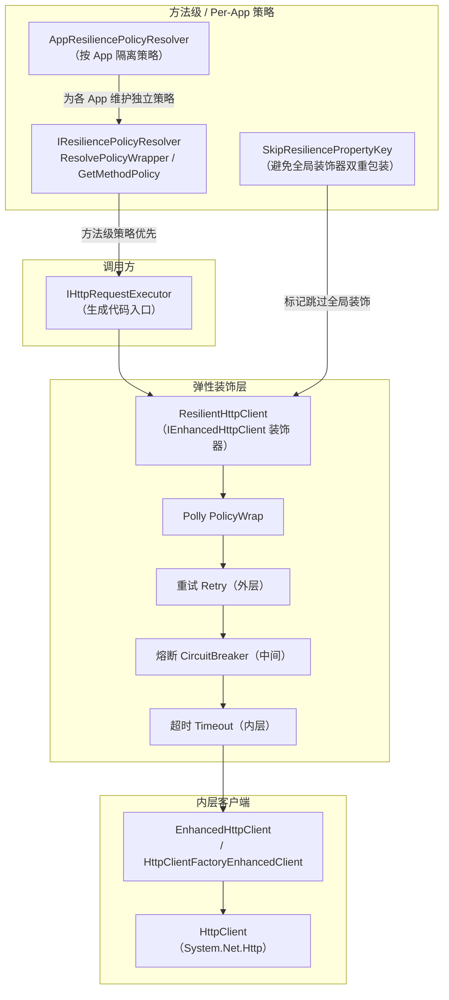
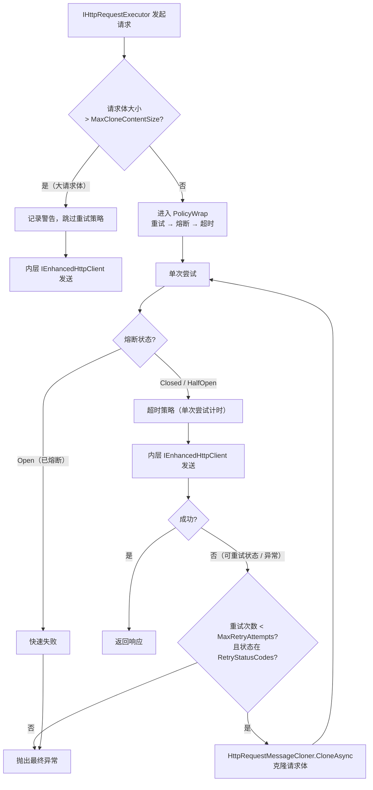

# Mud.HttpUtils.Resilience

## 概述

Mud.HttpUtils.Resilience 是 Mud.HttpUtils 的弹性策略层，基于 Polly 提供重试、超时、熔断策略，通过装饰器模式增强 `IEnhancedHttpClient`。

## 目标框架

- `netstandard2.0`
- `net6.0`
- `net8.0`
- `net10.0`

## 包含内容

### 核心类

| 类 | 说明 |
|-----|------|
| `ResilientHttpClient` | `IEnhancedHttpClient` 的弹性装饰器，组合重试/超时/熔断策略，并实现 `IEncryptableHttpClient`（加解密路径不经过 Polly 包装） |
| `PollyResiliencePolicyProvider` | 基于 Polly 的策略提供器，根据 `ResilienceOptions` 创建策略（含重试抖动 Jitter） |
| `ResiliencePolicyResolver` | `IResiliencePolicyResolver` 实现，解耦 `IHttpRequestExecutor` 与具体弹性策略，封装请求克隆逻辑 |
| `AppResiliencePolicyResolver` | 按应用（App）解析弹性策略的工厂，为每个 App 维护独立的策略提供器与解析器 |
| `HttpRequestMessageCloner` <sup>internal</sup> | HTTP 请求消息克隆工具（internal），确保重试安全，提供 `CloneAsync` / `TryCloneAsync` |
| `ResilienceOptionsValidator` | `IValidateOptions<ResilienceOptions>` 实现，校验重试延迟与超时的跨选项冲突 |
| `ResilienceOptionsCrossValidator` | `IPostConfigureOptions<ResilienceOptions>` 实现，检查 `HttpClient.Timeout` 与 Polly 重试/超时的潜在冲突，记录警告日志 |
| `ResilienceOptions` | 弹性策略配置选项 |
| `ResilienceConstants` | 弹性策略常量定义（含 `SkipResiliencePropertyKey`，用于避免方法级策略与全局装饰器双重包装） |
| `RetryDiagnosticPayload` / `TimeoutDiagnosticPayload` | 诊断事件负载类型，支持分布式追踪 |
| `IResiliencePolicyProvider` | 弹性策略提供器接口，支持自定义策略实现 |

### 策略组合顺序

组合策略执行顺序：**重试（外层） → 熔断 → 超时（内层）**

- 每次请求先经过超时策略限制
- 超时的请求会被熔断器统计
- 重试策略在所有内层策略之外

> **超时配置说明**：`HttpClient.Timeout`（通过 `MudHttpClientOptions.TimeoutSeconds` 配置）与 Polly 的 `TimeoutOptions.TimeoutSeconds` 是两个独立的超时机制。
> - `HttpClient.Timeout` 是 .NET HttpClient 内置的全局超时，作用于整个请求生命周期（包括重试）。
> - `TimeoutOptions.TimeoutSeconds` 是 Polly 的单次请求超时，仅作用于单次尝试（每次重试独立计时）。
> - 建议将 `HttpClient.Timeout` 设置为略大于 `Retry.MaxRetryAttempts × TimeoutOptions.TimeoutSeconds + 总重试延迟`，避免 HttpClient 超时打断正常的重试流程。
> - 启用弹性策略后，如果未显式设置 `HttpClient.Timeout`，Polly 超时策略将作为主要超时控制。

### 请求克隆与大小限制

`HttpRequestMessageCloner` 用于在重试时克隆请求消息（因为 `HttpRequestMessage` 不可重用）。新增内容大小限制功能：

```csharp
// 默认最大克隆大小为 10MB
public const long DefaultMaxContentSize = 10 * 1024 * 1024;

// 克隆时检查大小
var cloned = await HttpRequestMessageCloner.CloneAsync(request, maxContentSize: 10 * 1024 * 1024);
```

> 当请求体大小超过 `MaxCloneContentSize` 时，`ResilientHttpClient` 会自动跳过重试策略，避免克隆大请求体的性能开销。适用于大文件上传等场景。

### 方法级 / Per-App 弹性策略

除全局装饰器外，本包还支持**方法级**与**按应用（Per-App）**的弹性策略编排：

- 生成代码通过 `IHttpRequestExecutor` + `IResiliencePolicyResolver`（`ResiliencePolicyResolver.ResolvePolicyWrapper` / `IResiliencePolicyProvider.GetMethodPolicy`）按方法级 `[Retry]`/`[Timeout]`/`[CircuitBreaker]` 特性构建策略。
- `AppResiliencePolicyResolver` 为每个 App 维护独立的 `PollyResiliencePolicyProvider` 与 `ResiliencePolicyResolver`，实现多租户策略隔离。
- `ResilienceConstants.SkipResiliencePropertyKey`（`"__Mud_HttpUtils_SkipResilience"`）用于标记请求已由方法级策略包装，使全局装饰器跳过，避免双重包装。

> `AddMudHttpResilienceDecorator` 在 .NET 8+ 上通过 Keyed Services（`DecorateKeyedServices`）装饰带键的 `IEnhancedHttpClient` 注册，兼容多命名客户端场景。

### 重试回调机制

`RetryOptions` 提供 `OnRetry` 属性，支持在每次重试前执行自定义逻辑：

```csharp
services.AddMudHttpUtils("myApi", "https://api.example.com", options =>
{
    options.Retry.MaxRetryAttempts = 3;
    options.Retry.OnRetry = async (exception, retryCount, delay) =>
    {
        Console.WriteLine($"第 {retryCount} 次重试，延迟 {delay.TotalMilliseconds}ms，异常: {exception?.Message}");
    };
});
```

> `OnRetry` 签名为 `Func<Exception?, int, TimeSpan, Task>`，参数分别为：触发的异常（可能为 null）、重试次数（从 1 开始）、下次重试前的延迟时间。可用于日志记录、指标收集、动态调整重试策略等。

## 弹性策略执行逻辑

弹性策略通过**装饰器模式**叠加在 `IEnhancedHttpClient` 之上，并由 `IResiliencePolicyResolver` 支持方法级 / Per-App 的独立编排。下图展示装饰器分层结构：



单次请求在装饰器内部经历「重试 → 熔断 → 超时」的嵌套编排，重试时通过 `HttpRequestMessageCloner` 克隆请求体：



> **要点**：
> - 策略组合顺序为 **重试（外层）→ 熔断（中间）→ 超时（内层）**：超时仅作用于单次尝试（每次重试独立计时），重试统计包含熔断结果。
> - 请求体超过 `MaxCloneContentSize`（默认 10MB）时自动跳过重试，避免克隆大请求体的开销（适用大文件上传）。
> - 方法级 `[Retry]`/`[Timeout]`/`[CircuitBreaker]` 经 `IResiliencePolicyResolver` 构建，并通过 `SkipResiliencePropertyKey` 标记，避免与全局装饰器双重包装。

## 配置选项

### ResilienceOptions

| 属性 | 类型 | 默认值 | 说明 |
|------|------|--------|------|
| `Retry` | `RetryOptions` | — | 重试策略配置 |
| `Timeout` | `TimeoutOptions` | — | 超时策略配置 |
| `CircuitBreaker` | `CircuitBreakerOptions` | — | 熔断策略配置 |
| `MaxCloneContentSize` | `long` | `10485760` (10MB) | 请求克隆的最大内容大小（字节），-1 表示不限制 |

### RetryOptions

| 属性 | 类型 | 默认值 | 说明 |
|------|------|--------|------|
| `Enabled` | `bool` | `true` | 是否启用重试策略 |
| `MaxRetryAttempts` | `int` | `3` | 最大重试次数 |
| `DelayMilliseconds` | `int` | `1000` | 基础延迟时间（毫秒） |
| `UseExponentialBackoff` | `bool` | `true` | 是否使用指数退避 |
| `RetryStatusCodes` | `int[]?` | `null`（运行时回退到 `[408, 429, 500, 502, 503, 504]`） | 触发重试的 HTTP 状态码。`null`（未设置）使用默认值；`[]`（空数组）表示不重试任何状态码，仅 `HttpRequestException`/`TimeoutRejectedException`/`TaskCanceledException` 触发重试（运行时记录警告日志） |
| `OnRetry` | `Func<Exception?, int, TimeSpan, Task>?` | `null` | 重试回调函数（仅支持代码配置，无法从 IConfiguration 绑定） |

### TimeoutOptions

| 属性 | 类型 | 默认值 | 说明 |
|------|------|--------|------|
| `Enabled` | `bool` | `true` | 是否启用超时策略 |
| `TimeoutSeconds` | `int` | `30` | 超时时间（秒） |

### CircuitBreakerOptions

| 属性 | 类型 | 默认值 | 说明 |
|------|------|--------|------|
| `Enabled` | `bool` | `false` | 是否启用熔断策略 |
| `FailureThreshold` | `int` | `5` | 触发熔断的阈值（含义取决于 `SamplingDurationSeconds`） |
| `BreakDurationSeconds` | `int` | `30` | 熔断持续时间（秒） |
| `SamplingDurationSeconds` | `int` | `0` | 采样窗口时间（秒），大于 0 时启用高级熔断策略 |
| `MinimumThroughput` | `int` | `10` | 采样窗口内最小请求数（仅高级熔断策略生效） |

> **熔断模式说明**：
> - 当 `SamplingDurationSeconds = 0`（默认）时，使用**简单熔断策略**，`FailureThreshold` 表示连续失败次数
> - 当 `SamplingDurationSeconds > 0` 时，使用**高级熔断策略**，`FailureThreshold` 表示采样窗口内的失败率百分比（1-100）

## 安装

```xml
<PackageReference Include="Mud.HttpUtils.Resilience" Version="x.x.x" />
```

## 使用方式

### 代码配置

```csharp
services.AddMudHttpResilienceDecorator(options =>
{
    // 重试策略
    options.Retry.Enabled = true;
    options.Retry.MaxRetryAttempts = 3;
    options.Retry.DelayMilliseconds = 1000;
    options.Retry.UseExponentialBackoff = true;
    options.Retry.RetryStatusCodes = [408, 429, 500, 502, 503, 504];
    options.Retry.OnRetry = async (ex, retryCount, delay) =>
    {
        logger.LogWarning("HTTP 请求重试 {RetryCount}，延迟 {Delay}ms", retryCount, delay.TotalMilliseconds);
    };

    // 超时策略
    options.Timeout.Enabled = true;
    options.Timeout.TimeoutSeconds = 30;

    // 熔断策略
    options.CircuitBreaker.Enabled = true;
    options.CircuitBreaker.FailureThreshold = 5;
    options.CircuitBreaker.BreakDurationSeconds = 30;

    // 请求克隆大小限制
    options.MaxCloneContentSize = 10 * 1024 * 1024; // 10MB
});
```

### 配置文件绑定

```csharp
services.AddMudHttpResilienceDecorator(configuration, "MudHttpResilience");
```

对应 `appsettings.json`：

```json
{
  "MudHttpResilience": {
    "MaxCloneContentSize": 10485760,
    "Retry": {
      "Enabled": true,
      "MaxRetryAttempts": 3,
      "DelayMilliseconds": 1000,
      "UseExponentialBackoff": true,
      "RetryStatusCodes": [408, 429, 500, 502, 503, 504]
    },
    "Timeout": {
      "Enabled": true,
      "TimeoutSeconds": 30
    },
    "CircuitBreaker": {
      "Enabled": true,
      "FailureThreshold": 5,
      "BreakDurationSeconds": 30,
      "SamplingDurationSeconds": 0,
      "MinimumThroughput": 10
    }
  }
}
```

**高级熔断策略**（基于采样窗口的失败率模式）：

```json
{
  "CircuitBreaker": {
    "Enabled": true,
    "FailureThreshold": 50,
    "BreakDurationSeconds": 30,
    "SamplingDurationSeconds": 60,
    "MinimumThroughput": 10
  }
}
```

> 高级模式下 `FailureThreshold = 50` 表示采样窗口内失败率达 50% 时触发熔断，至少需要 `MinimumThroughput` 次请求。

> **配置热更新说明**：当通过 `IConfiguration` 绑定（如 `AddMudHttpResilience(configuration)`）时，`ResilienceOptions` 的配置绑定本身支持 `IOptionsMonitor<ResilienceOptions>` 变更通知。但 `PollyResiliencePolicyProvider` 注册为单例，并通过 `IOptions<ResilienceOptions>`（非 `IOptionsMonitor`）读取配置，因此 Polly 策略在应用启动时创建一次，**不会**在运行时自动热更新。如需更新弹性策略，请重启应用或重新注册策略提供器。
>
> **注意**：`OnRetry` 回调委托为代码类型，无法从配置文件绑定。如需设置 `OnRetry`，请使用 `Action<ResilienceOptions>` 委托重载。

### 配置校验与跨选项警告

本包提供两层配置校验机制：

#### 1. 启动时校验 — `ResilienceOptionsValidator`

`ResilienceOptionsValidator` 实现了 `IValidateOptions<ResilienceOptions>`，在选项绑定时自动执行跨选项校验：

- 当 `Retry.Enabled` 和 `Timeout.Enabled` 同时为 `true` 时，校验重试总延迟（含指数退避）是否超过单次超时时间 `Timeout.TimeoutSeconds`。超出时 `IOptions.Validate` 返回失败，应用启动抛出异常。
- 当 `Retry.Enabled` 或 `Timeout.Enabled` 为 `false` 时，跳过此校验。

#### 2. 运行时跨选项警告 — `ResilienceOptionsCrossValidator`

`ResilienceOptionsCrossValidator` 实现了 `IPostConfigureOptions<ResilienceOptions>`，在选项绑定时检查 `HttpClient.Timeout`（通过 `MudHttpClientApplicationOptions.Clients[*].TimeoutSeconds` 配置）与 Polly 重试/超时策略之间的潜在冲突：

- 计算所有已配置客户端中最小的 `TimeoutSeconds`，与重试总时间预估（重试延迟 + 重试次数 × 单次超时）进行比较。
- 当 `HttpClient.Timeout` 小于重试总时间预估时，记录 **警告日志**（不阻止应用启动）。
- 仅当同时注册了 `MudHttpClientApplicationOptions`（即通过 `AddMudHttpClientsFromConfiguration` 注册）时生效。

> **说明**：此校验器仅记录警告而非阻止启动，因为某些场景下用户可能有意设置较短的全局超时。建议参考警告日志调整 `TimeoutSeconds` 配置。

### 一站式注册

```csharp
services.AddMudHttpUtils("myApi", "https://api.example.com", options =>
{
    options.Retry.MaxRetryAttempts = 3;
    options.Timeout.TimeoutSeconds = 30;
    options.MaxCloneContentSize = 5 * 1024 * 1024; // 5MB
});
```

### 大文件上传场景

对于大文件上传等场景，建议禁用重试或增大克隆限制：

```csharp
// 方式一：增大克隆限制
options.MaxCloneContentSize = 100 * 1024 * 1024; // 100MB

// 方式二：禁用重试
options.Retry.Enabled = false;

// 方式三：不限制（不推荐）
options.MaxCloneContentSize = -1;
```

> 当请求体大小超过 `MaxCloneContentSize` 时，`ResilientHttpClient` 会记录警告日志并跳过重试，直接发送请求。

## DI 服务注册方法

| 方法 | 说明 |
|------|------|
| `AddMudHttpResilience(configureOptions)` | 仅注册策略服务（不装饰客户端） |
| `AddMudHttpResilience(configuration, sectionPath)` | 从配置绑定策略 |
| `AddMudHttpResilienceDecorator(configureOptions)` | 注册装饰器，为 `IEnhancedHttpClient` 添加弹性策略 |
| `AddMudHttpResilienceDecorator(configuration, sectionPath)` | 从配置绑定的装饰器注册 |
| `AddMudHttpUtils(clientName, configureHttpClient, configureResilienceOptions)` | 一站式注册 Client + Resilience |
| `AddMudHttpUtils(clientName, configureHttpClient, enableResilience)` | 一站式注册，可选是否启用弹性策略 |
| `AddMudHttpUtils(clientName, baseAddress, configureResilienceOptions)` | 带基础地址的一站式注册 |
| `AddMudHttpUtils(clientName, baseAddress, enableResilience)` | 带基础地址的一站式注册，可选是否启用弹性策略 |
| `AddMudHttpUtils(clientName, configuration, configureHttpClient, sectionPath)` | 从配置绑定弹性策略的一站式注册 |
| `AddMudHttpUtils(clientName, configureEncryption, configureHttpClient, configureResilienceOptions)` | 带 AES 加密的一站式注册 |

> **注意**：`AddMudHttpResilienceDecorator` 必须在 `AddMudHttpClient` 之后调用。

## 依赖项

| 包 | 说明 |
|----|------|
| `Mud.HttpUtils.Abstractions` | 接口定义 |
| `Mud.HttpUtils.Client` | 客户端实现（装饰器目标） |
| `Polly` | 弹性策略库 |
| `Microsoft.Extensions.Logging.Abstractions` | 日志抽象 |
| `Microsoft.Extensions.Options` | 选项模式 |

## 设计原则

- **装饰器模式**：`ResilientHttpClient` 装饰 `IEnhancedHttpClient`，不修改原始实现
- **策略组合**：通过 Polly PolicyWrap 组合多种策略，执行顺序可控
- **安全重试**：通过 `HttpRequestMessageCloner` 克隆请求消息，确保重试安全
- **性能保护**：通过 `MaxCloneContentSize` 限制克隆大小，避免大请求体的克隆开销
- **可观测性**：通过 `OnRetry` 支持自定义重试回调，便于日志记录和指标收集；内置诊断事件负载（`RetryDiagnosticPayload`、`TimeoutDiagnosticPayload`）支持分布式追踪
- **配置灵活**：支持代码配置和配置文件绑定
- **AOT 兼容**：`ResilientHttpClient` 装饰器与策略编排均为静态类型与委托，无运行时反射，可在 Native AOT 下使用
